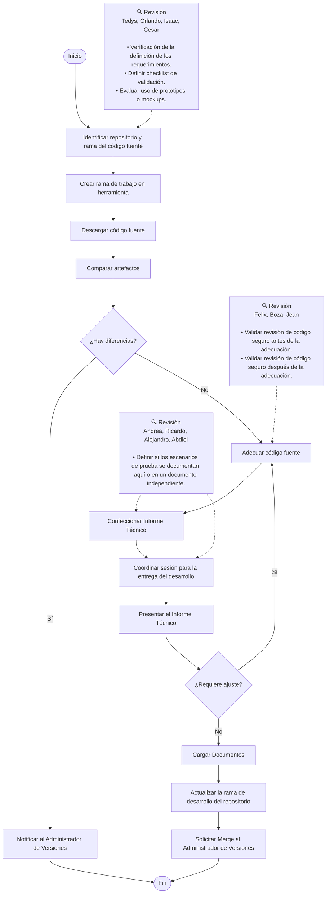

```mermaid
flowchart TD

    A([Inicio]) --> B[Identificar repositorio y rama del código fuente]
    B --> C[Crear rama de trabajo en herramienta]
    C --> D[Descargar código fuente]
    D --> E[Comparar artefactos]

    E --> F{¿Hay diferencias?}

    F -- Sí --> G[Notificar al Administrador de Versiones]
    G --> Z([Fin])

    F -- No --> H[Adecuar código fuente]

    H --> I[Confeccionar Informe Técnico]
    I --> J[Coordinar sesión para la entrega del desarrollo]
    J --> K[Presentar el Informe Técnico]

    K --> L{¿Requiere ajuste?}

    L -- Sí --> H
    L -- No --> M[Cargar Documentos]
    M --> N[Actualizar la rama de desarrollo del repositorio]
    N --> O[Solicitar Merge al Administrador de Versiones]
    O --> Z

    %% Revisiones

    R1["🔍 Revisión<br/>Tedys, Orlando, Isaac, Cesar<br/><br/>• Verificación de la definición de los requerimientos.<br/>• Definir checklist de validación.<br/>• Evaluar uso de prototipos o mockups."]
    R1 -.-> B

    R2["🔍 Revisión<br/>Andrea, Ricardo, Alejandro, Abdiel<br/><br/>• Definir si los escenarios de prueba se documentan aquí o en un documento independiente."]
    R2 -.-> I
    R2 -.-> J

    R3["🔍 Revisión<br/>Felix, Boza, Jean<br/><br/>• Validar revisión de código seguro antes de la adecuación.<br/>• Validar revisión de código seguro después de la adecuación."]
    R3 -.-> H
```