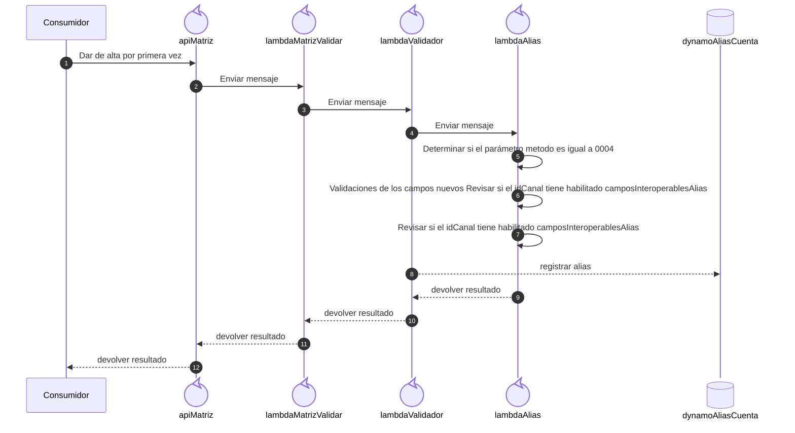

```mermaid
sequenceDiagram
    autonumber

    %% Declaración de actores
    participant call as Consumidor
    participant apiMatriz@{ type: "control", label: "tld-matriz" }
    participant lambdaMatrizValidar@{ type: "control", label: "tld-matriz-validador-validar" }
    participant lambdaValidador@{ type: "control", label: "tld-validador-validar" }
    participant lambdaAlias@{ type: "control", label: "tld-alias-cuenta" }
    participant dynamoAliasCuenta@{ type: "database", label: "tld-alias-cuenta" }

    call->>apiMatriz: Dar de alta por primera vez
    apiMatriz->>lambdaMatrizValidar: Enviar mensaje
    lambdaMatrizValidar->>lambdaValidador: Enviar mensaje
    lambdaValidador->>lambdaAlias: Enviar mensaje

    lambdaAlias->>lambdaAlias: Determinar si el parámetro metodo es igual a 0004
    lambdaAlias->>lambdaAlias: Validaciones de los campos nuevos Revisar si el idCanal tiene habilitado camposInteroperablesAlias
    lambdaAlias->>lambdaAlias: Revisar si el idCanal tiene habilitado camposInteroperablesAlias

    lambdaValidador-->>dynamoAliasCuenta: registrar alias

    lambdaAlias-->>lambdaValidador: devolver resultado
    lambdaValidador-->>lambdaMatrizValidar: devolver resultado
    lambdaMatrizValidar-->>apiMatriz: devolver resultado
    apiMatriz-->>call: devolver resultado
```