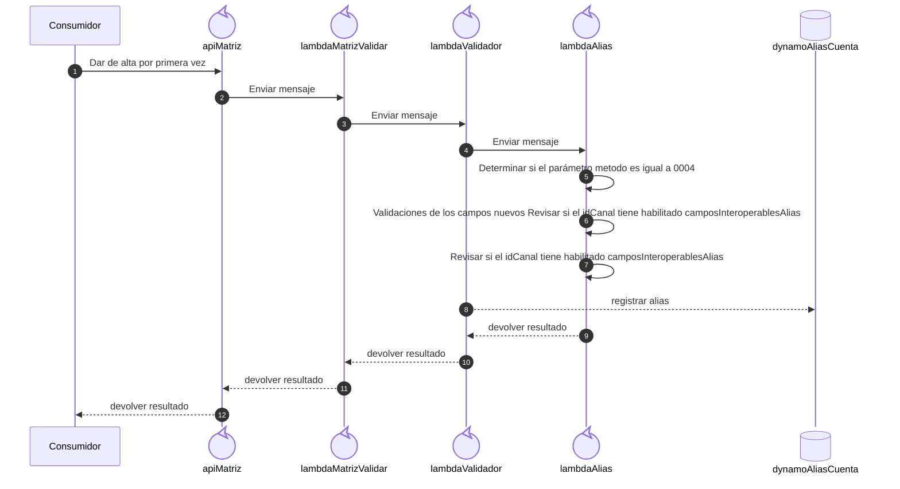

## Xpress
Este es el servicio que actualmente tenemos de Xpress
Los cambios que debemos de hacer en este servicio, es la incorporación de los campos relacionados a las datos del documento de identificación y nombre de la persona en los los datos de los Alias en nuestro directorio central.
Esquema para indicar los nuevos campos:


```json
{
  "type": "object",
  "required": [
    "tipoDocumento",
    "documento",
    "primerNombre",
    "segundoNombre",
    "primerApellido",
    "segundoApellido",
    "fraudIndicator",
    "esFavorito"
  ],
  "properties": {
    "tipoDocumento": {
      "type": "string",
      "enum": [
        "CEDULA",
        "PASAPORTE"
      ]
    },
    "documento": {
      "type": "string",
      "maxLength": 27
    },
    "primerNombre": {
      "type": "string",
      "description": "Longitud pendiente de definir."
    },
    "segundoNombre": {
      "type": "string",
      "description": "Longitud pendiente de definir."
    },
    "primerApellido": {
      "type": "string",
      "description": "Longitud pendiente de definir."
    },
    "segundoApellido": {
      "type": "string",
      "description": "Longitud pendiente de definir."
    },
    "fraudIndicator": {
      "type": "object",
      "required": [
        "flagged",
        "source"
      ],
      "description": "Signal from the destination's confirmed-fraud list.",
      "properties": {
        "flagged": {
          "type": "boolean"
        },
        "source": {
          "type": "string",
          "description": "Participant that originated the signal."
        },
        "reasonCode": {
          "type": "string"
        },
        "reportedAt": {
          "type": "string",
          "format": "date-time"
        }
      }
    }
  }
}
```


### Método 0004 Dar de alta por primera vez





Ejemplo de request
```json
{
    "idCanal": "1576",
    "validador": "0001",
    "peticion": {
        "idPeticion": "MEOWPAPA000000000001",
        "metodo": "0004",
        "solicitudes": [
            {
                "idSolicitud": "1",
                "parametros": {
                    "identificador": "69852374",
                    "tipoIdentificador": "CELULAR",
                    "idPregunta": "02",
                    "respuesta": "calle federico boyd",
                    "banco": "MEOWPAPA",
                    "cuenta": "456069852372001",
                    "producto": "PACA",
                    "cliente": {
                        "tipoDocumento": "CEDULA",
                        "documento": "6-123-1234",
                        "primerNombre": "Luciana",
                        "segundoNombre": "Auxesis",
                        "primerApellido": "Theodoro",
                        "segundoApellido": "de Montefío"
                    },
                    "fraudIndicator": {
                        "flagged": true,
                        "source": "string",
                        "reasonCode": "string",
                        "reportedAt": "2019-08-24T14:15:22Z"
                    }
                }
            }
        ]
    }
}
```

Ejemplo de response
```json
{
    "respuesta": {
        "idPeticion": "MEOWPAPA00000000001788894973",
        "respuestas": [
            {
                "idSolicitud": "1",
                "resultado": 0,
                "datos": {
                    "id": "71507ef4-217b-4a3e-9a8c-ea97f5d127bf",
                    "identificador": "69852374",
                    "tipoIdentificador": "CELULAR",
                    "banco": "MEOWPAPA",
                    "cuenta": "456069852372001",
                    "producto": "PACA",
                    "estado": "A",
                    "creado": "2026-09-08 14:16:03.427",
                    "actualizado": "2026-09-08 14:16:03.427",
                    "cliente": {
                        "tipoDocumento": "CEDULA",
                        "documento": "6-123-1234",
                        "primerNombre": "Luciana",
                        "segundoNombre": "Auxesis",
                        "primerApellido": "Theodoro",
                        "segundoApellido": "de Montefío"
                    },
                    "fraudIndicator": {
                        "flagged": true,
                        "source": "string",
                        "reasonCode": "string",
                        "reportedAt": "2019-08-24T14:15:22Z"
                    }
                }
            }
        ]
    }
}
```


