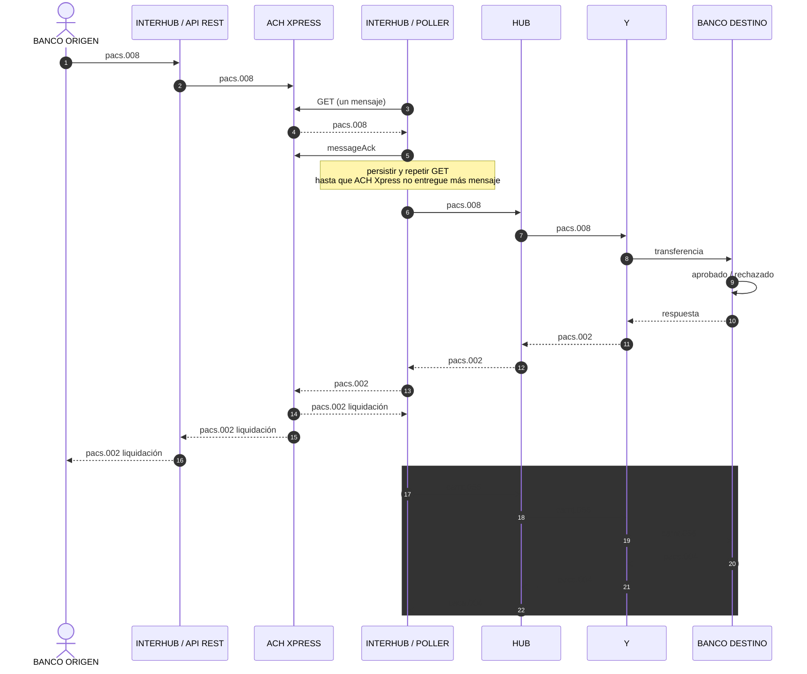
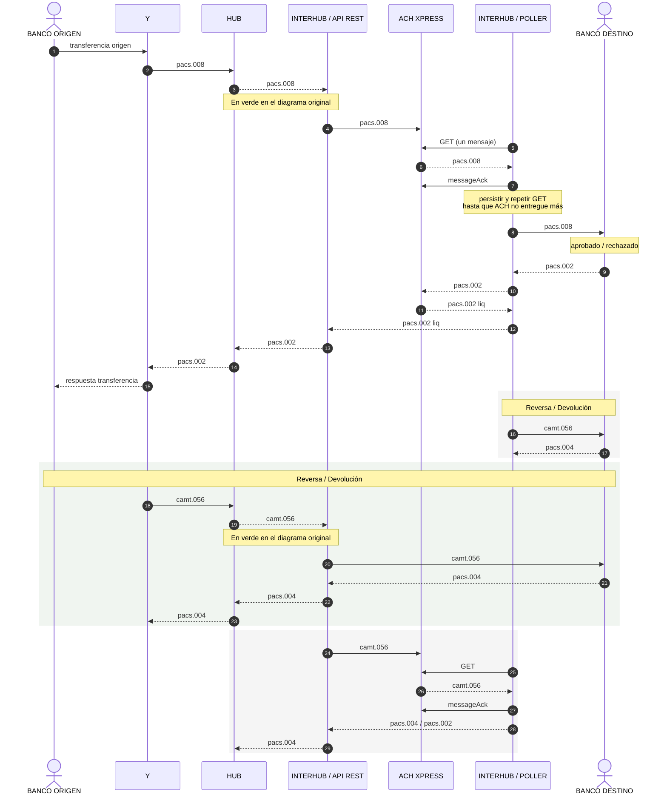

# FMR-DES-002 — INTERHUB

Documento de diseño. Empezamos solo con los diagramas; el resto (APIs, poller, workers) lo armamos después, de a una pieza.

---

## Contexto — dónde estamos

Nosotros estamos en el **Procesador X**. Lo que vamos a desarrollar es **INTERHUB** (API Rest + Poller).

| Rol en el ecosistema | Qué incluye | ¿Lo desarrollamos? |
|---|---|---|
| **Procesador X** | INTERHUB / API Rest · **ACH Xpress (Core Transaccional)** · INTERHUB / Poller | Solo INTERHUB (API Rest y Poller) |
| **HUB** | HUB | No |
| **Procesador Y** | Y · Banco destino | No |

Lectura rápida de los diagramas:

- Cuando ves **INTERHUB / API Rest** o **INTERHUB / Poller** → es **nuestro** código.
- Cuando ves **ACH Xpress** → es el **Core Transaccional** del Procesador X. INTERHUB habla con él (enviar, GET, ACK). No lo desarrollamos nosotros.
- Cuando ves **HUB**, **Y**, **Banco destino** → están fuera; INTERHUB se integra con ellos.

---

## Diagramas de Flujos

Hay **dos sentidos**. No son el mismo caso:

| Diagrama | Sentido | Quién inicia el crédito | Qué hace INTERHUB (nosotros) |
|---|---|---|---|
| 1 | Procesador X → Procesador Y | Banco origen envía `pacs.008` por API Rest a ACH; Poller GET → HUB/Y; liquidación al banco la entrega la API Rest (ACH → API → banco) | API Rest: entrada `pacs.008` y salida `pacs.002` liq al banco. Poller: GET/ACK, HUB, `pacs.002` y liq con ACH |
| 2 | Procesador Y → Procesador X | Banco origen entra por Y → HUB; INTERHUB API recibe del HUB y empuja a ACH Xpress; INTERHUB Poller hace el GET | Recibir del HUB, enviar a ACH, GET/ACK, entregar al banco destino y devolver liquidación / reversas al HUB |

Los rectángulos grises son **caminos alternativos** (reversas), no pasos que siempre ocurren en el flujo feliz.

---

### 1. Procesador X → Procesador Y

Flujo donde el crédito **entra por nosotros** (Procesador X).

Orden del flujo feliz:

1. Banco origen → API Rest → ACH Xpress: `pacs.008`
2. Poller hace GET a ACH, ACK, lleva el `pacs.008` al HUB → Y → Banco destino
3. Vuelve `pacs.002` (HUB → Poller → ACH); ACH da `pacs.002` liquidación al Poller
4. ACH da `pacs.002` liquidación a la API Rest; la API Rest lo entrega al Banco origen

El Poller **no** entrega la liquidación al Banco origen. Sí sigue hablando con ACH (GET, ACK, `pacs.002`, liquidación).

---

### 2. Procesador Y → Procesador X

Flujo donde el crédito **nace en el Procesador Y** (vía Y → HUB). Mismos componentes INTERHUB que en el diagrama 1: **API Rest**, **ACH Xpress (Core Transaccional)** y **Poller**. El GET lo hace nuestro Poller (igual que en X → Y).

---

## Pendiente (no escribir aún)

Cuando digas que los diagramas están bien, seguimos con lo del borrador: componentes AWS, API Banco origen, API HUB, poller, workers.
