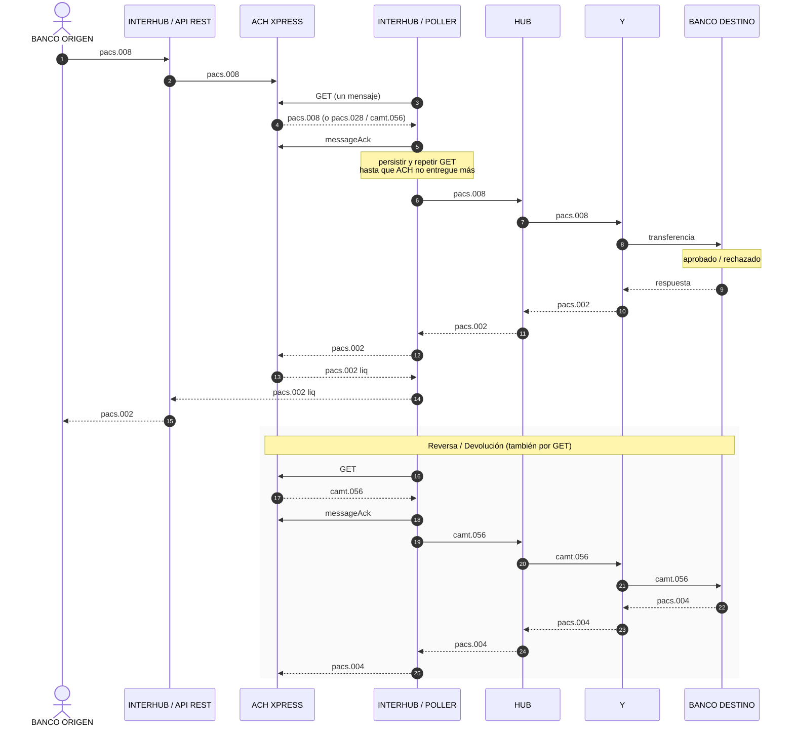

# INTERHUB — análisis

Conector entre **Banco origen**, **ACH Xpress**, **HUB** y **Banco destino**.

ISO 20022: `pacs.###` (pagos) y `camt.###` (caja / reversa). Un GET a ACH Xpress entrega **un** mensaje. Si hay más pendientes, hay que seguir haciendo GET hasta vaciar.

---

## 1. Flujo de punta a punta

El crontab de INTERHUB **no recibe push** de ACH Xpress: **hace GET**. La reversa (`camt.056`) entra por el mismo GET, no por un canal distinto.



---

## 2. Piezas en AWS

| Rol INTERHUB | AWS | Qué hace |
|---|---|---|
| API Banco origen | API Gateway + Lambda | Métodos `0026`, `0027`, `0028`. Contrato Autopista; `parametros` según HUB / pacs. |
| API HUB | API Gateway + Lambda | Contrato HUB: alias, crédito, reversa, estado, echo, webhooks. |
| Sacar mensajes de ACH Xpress | EventBridge + Lambda **poller** | GET de a uno, guardar, ACK, repetir GET. **No** hace el negocio. |
| Cola de trabajo | SQS | Un mensaje persistido = un ítem. Otro proceso lo consume. |
| Procesar cada tipo | Lambda(s) consumidoras de SQS | Según `pacs.008` / `pacs.028` / `camt.056` → HUB o banco destino. |
| Batch on-prem | (sin definir) | Procesos en premisa. Vacío a propósito. |

El poller y el procesador **no** son la misma Lambda. El GET tiene que ser rápido y exclusivo. Convertir a HUB, llamar al destino, reintentar: eso va en el worker. Si el worker falla, el mensaje ya no está en ACH (se hizo ACK); tiene que estar en SQS.

---

## 3. Cómo sacar varios mensajes con GET de a uno

ACH Xpress entrega **un** `pacs.###` o `camt.###` por GET. En ese instante puede haber N en cola. INTERHUB tiene que **vaciar**: GET → guardar → ACK → GET otra vez, hasta que la respuesta venga vacía.

### 3.1 Qué no hacer

- Un EventBridge que dispara, hace **un** GET y se duerme hasta el próximo tick. Los demás mensajes se quedan en ACH hasta el siguiente minuto (o más, si el intervalo es largo).
- Varias Lambdas haciendo GET en paralelo. Es una cola de un consumidor: dos pollers pelean el mismo mensaje, duplican ACK o se saltan ítems.
- Procesar (llamar HUB, transformar XML) **dentro** del GET. El poller se alarga, vence el timeout de Lambda y deja mensajes sin ACK o ACKeados sin persistir.

### 3.2 Diseño

```
EventBridge (cada X segundos)
        │
        ▼
Lambda POLLER  ──concurrency = 1──
        │
        │  loop mientras ACH entregue y quede tiempo
        │    1. GET
        │    2. si vacío → salir
        │    3. guardar en SQS (cuerpo o puntero S3)
        │    4. messageAck
        │    5. repetir
        │
        ▼
      SQS
        │
        ├─ worker pacs.008  → HUB o banco destino
        ├─ worker pacs.028  → (definir)
        └─ worker camt.056  → HUB (reversa)
```

**EventBridge** solo despierta al poller. No “sabe” cuántos hay. El bucle dentro de la invocación saca todos los que pueda.

**Un solo poller a la vez.** Reserved concurrency = 1 en esa Lambda (o un lock en DynamoDB). Si el schedule es cada 30 s y un drain dura 45 s, sin esto arranca un segundo GET encima del primero.

**Orden por mensaje: persistir, después ACK.**

1. GET
2. Escribir en SQS (esperar confirmación de SQS)
3. `messageAck` a ACH Xpress
4. Siguiente GET

Si se hace ACK y después falla el save, ese `pacs`/`camt` desaparece de ACH y no está en SQS. Si se guarda y el ACK falla, el próximo GET puede devolver el mismo: el worker tiene que ser **idempotente** (mismo id de mensaje → no pagar dos veces).

**Tope de tiempo, no bucle infinito.** Lambda máximo 15 min. El poller corta cuando:

- ACH responde vacío, o
- quedan ~30 s de timeout (el próximo EventBridge sigue vaciando), o
- N GETs en esta corrida (límite de seguridad)

### 3.3 Dónde guardar para “otro proceso”

| Destino | Cuándo |
|---|---|
| **SQS** (esto) | Payload cabe en 256 KB. El worker es otra Lambda. Reintentos y DLQ incluidos. |
| S3 + SQS con la clave | XML/ISO más grande que 256 KB. |
| DynamoDB | Si hace falta consultar por id / no reprocessar. No sustituye la cola. |

Tres colas SQS (una por tipo) o una sola con un atributo `tipoMensaje` y un router. Tres colas aíslan un `camt.056` lento de un `pacs.008`. Una cola es más simple al inicio.

### 3.4 Workers

El documento original pedía “una Lambda por posible resultado del GET”. Eso aplica al **procesador**, no al poller:

| Mensaje | Acción |
|---|---|
| `pacs.008` | Origen = X → convertir a formato HUB y enviar al HUB. Origen ≠ X → enviar al banco destino. |
| `pacs.028` | (sin detalle aún) |
| `camt.056` | Reversa hacia HUB. Pendiente validación Minsait: si ACH lo entrega por este GET o no. |

Cada mensaje trae procesador origen y destino.

### 3.5 Alternativa si el drain es largo o hay que ver cada paso

Step Functions: bucle GET → SQS → ACK → ¿vacío? Si el volumen es bajo, el bucle en una Lambda alcanza. Step Functions suma visibilidad y reintentos; no cambia el modelo (un GET, un persist, un ACK).

---

## 4. API REST — Banco origen

API Gateway + Lambda. Contrato Autopista; en `parametros`, reglas HUB / pacs.

`idCanal`: igual que en Xpress.

`validador`: id del HUB. El HUB se configura en el PAC como validador.

### Request

```json
{
  "idCanal": "",
  "validador": "",
  "peticion": {
    "idPeticion": "",
    "metodo": "",
    "solicitudes": [
      {
        "idSolicitud": "",
        "parametros": {}
      }
    ]
  }
}
```

`parametros`: campos del doc HUB | pacs.008 (esp. HUB) | pacs.028 (esp. HUB).

### Métodos

| Método | Nombre | Estado del detalle |
|---|---|---|
| `0026` | Consulta del directorio interoperable | Sin detalle |
| `0027` | Solicitud de crédito (`pacs.008`) | Abajo |
| `0028` | Consulta de estado de una solicitud de crédito (`pacs.028`) | Sin detalle |

**`0027`**

1. Recibe `pacs.008` del banco origen.
2. Lo envía a ACH Xpress.
3. Recibe `pacs.002` de ACH Xpress.
4. Devuelve ese `pacs.002` al banco origen.

---

## 5. API REST — HUB

API Gateway + Lambda. Contrato HUB (no Autopista).

Mínimo a exponer:

- Consulta de alias (mensaje estándar HUB)
- Crédito (HUB sobre `pacs.008`)
- Reversa (HUB sobre `camt.056`)
- Estado de transacción (HUB sobre `pacs.028`)
- EchoTest — estado del procesador Telered
- Webhooks: archivo de incongruencias, conciliación, estado de procesadores, timeouts — **si Minsait lo confirma**

---

## 6. Abierto / a confirmar

- `0026` y `0028`: firma y comportamiento.
- `pacs.028` que llega por GET: qué hace el worker.
- `camt.056` por GET: depende de Minsait.
- Webhooks HUB: depende de Minsait.
- Batch on-prem: no hay alcance.
- Tamaño real del XML ISO vs límite 256 KB de SQS.
- Intervalo del EventBridge (compromiso latencia vs costo vs lock del poller).
- Texto de ACH: “el GET devuelve la **última** transacción”. Si es LIFO y hay varios, el orden no es el de llegada. Hay que confirmar con ACH si es cola FIFO o “el último”.
