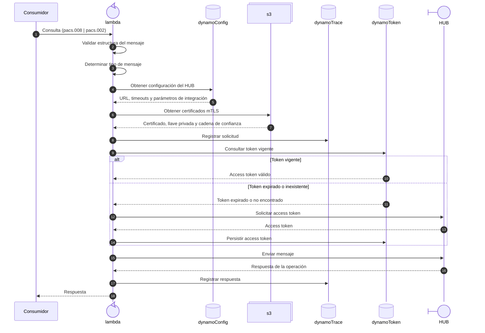
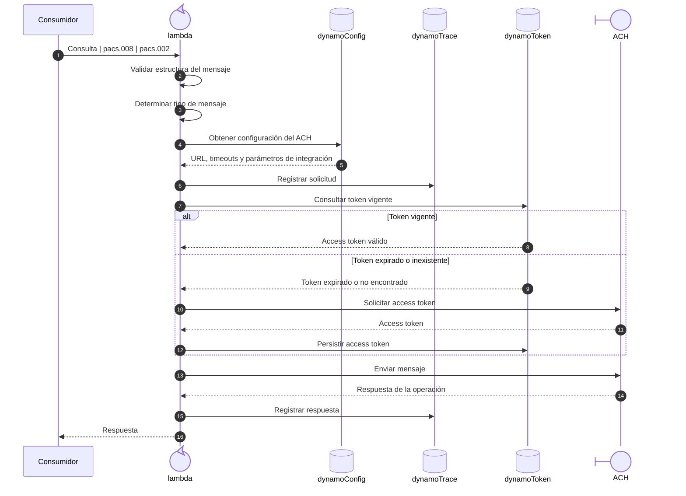

# Conectores

## Tiempos
Estos componentes son los encargados de la conexión con las API Rest externas. Para conectarse con HUB, Ach Xpress y Banco Destino

| Componente                                   | Tiempo  |
|----------------------------------------------|---------|
| INTERHUB Conector con HUB                    | 25 días |
| INTERHUB Conector con Ach Xpress             | 19 días |
| Sistema LBTR de Telered (Conversion archivo) | 10 días |
| Validador Proxy (Conector con Banco Destino) |  5 días |
| Subtotal:                                    | 59 días |

## INTERHUB Conector con HUB

## INTERHUB Conector con Ach Xpress

## Sistema LBTR de Telered (Conversion archivo)

## Validador Proxy

