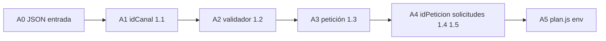

# Decisión — Fase A dividida (no monolítica)

**Decisión del agente:** 2026-07-05  
**Estado:** vigente hasta nuevo acuerdo  
**Contexto:** [03-estrategia-transversal-vs-parche.md](./03-estrategia-transversal-vs-parche.md)

## Pregunta

¿Ejecutar la **Fase A completa** en un solo bloque de trabajo, o **dividirla**?

## Decisión

**Dividir la Fase A en subfases A0–A5**, ejecutadas **en orden**, cada una con triage + Newman + checklist antes de la siguiente.

**No** implementar A0–A5 en un solo cambio de código.

## Por qué dividir (criterio experto)

| Factor | Fase A monolítica | Fase A dividida |
|--------|-------------------|-----------------|
| Verificación | Un Newman gigante; si falla 0001, no se sabe qué parte rompió | Cada subfase cierra un bloque Postman (`1.1`, `1.2`, …) |
| Riesgo 0001 | Alto — muchos archivos nuevos a la vez | Bajo — dominio proxy/cuenta intacto hasta Fase C |
| Capacidad del agente | Puede escribir todo; **no** puede desplegar ni Newman en VPN | Subfases acotadas = diffs revisables + usuario corre Newman en máquina corporativa |
| Dependencias | Mezcla refactor (`plan.js`) con comportamiento (`validaciones`) | Cada subfase entrega **comportamiento** verificable; refactors deferidos |
| Rollback | Difícil | Cada subfase es un commit/PR lógico |

## Por qué no micro-dividir más (p. ej. un escenario por PR)

- **A1 es atómica:** `validarParametroIdCanal` **sin** reordenar (plan antes de campos) no arregla 1.1.1. Orden + validación + `responderErrorSinCifrado` van juntos.
- Dividir por escenario individual multiplica commits sin reducir riesgo.

## Subfases — orden obligatorio

### A0 — JSON entrada (triage #1)

| | |
|--|--|
| **Checklist** | Sin ítems explícitos en run 2026-07-05; alinea contrato |
| **Cambio** | Mensaje `BAD_JSON` → `MSG_CATALOGO[400]` (*Error en la petición original*) |
| **Archivos** | `app.js` (mínimo) |
| **Newman** | Manual o escenario body inválido |
| **Triage** | [triage/01-json-entrada.md](./triage/01-json-entrada.md) — acción A1 pendiente |

**Nota:** Se puede **fusionar con A1** en el mismo PR (A0 es una línea).

### A1 — idCanal (Postman `1_validaciones_js/1_idCanal`) — **cerrada 2026-07-05**

| | |
|--|--|
| **Checklist** | ~14 escenarios 1.1.x |
| **Cambio** | `lib/validaciones.js` (copiar/adaptar base); `validarParametroIdCanal` **antes** de plan y `getCanal`; `responderErrorSinCifrado` para 400 sin cifrar; catálogo |
| **Reorden** | `parse → validarParametroIdCanal → getCanal emisor → validatePlan (temporal en util) → …` |
| **No tocar aún** | validador, petición post-descifrado, proxy, 0001 |
| **Triage** | Crear `triage/02-idCanal.md` al implementar |
| **Criterio done** | Bloque 1.1 del checklist en verde tras Newman — **cumplido** (run 2026-07-05T07:12Z, 14/14) |

### A2 — validador (`1.2_validador`) — **cerrada 2026-07-05**

| | |
|--|--|
| **Checklist** | Escenarios 1.2.x |
| **Cambio** | `validarParametroValidador`; `responderValidacionConCifrado`; orden emisor resuelto antes |
| **Env** | `CFG_CANAL_VALIDADOR` — ya en A1 |
| **Triage** | [triage/03-validador.md](./triage/03-validador.md) |
| **Criterio done** | Bloque 1.2 en verde — **cumplido** (run 2026-07-05T07:38Z, 15/15) |

### A3 — petición / descifrado (`1.3_peticion`) — **cerrada 2026-07-05**

| | |
|--|--|
| **Checklist** | Escenarios 1.3.x |
| **Cambio** | `validarParametroPeticion`; rama `abrirPaquete` alineada a base (405 vs 400, catálogo) |
| **Triage** | [triage/04-peticion.md](./triage/04-peticion.md) |
| **Criterio done** | Bloque 1.3 en verde — **cumplido** (run 2026-07-05T07:53Z, 13/13) |

### A4 — idPeticion + solicitudes (`1.4`, `1.5`) — **en curso 2026-07-05**

| | |
|--|--|
| **Checklist** | Escenarios 1.4.x, 1.5.x |
| **Cambio** | `validarParametroIdPeticion`, `validarParametroSolicitudes`; `CFG_METODOS_LIMITES_JSON` = `{ "0001": 1 }` (**temporal `{ "0001": 2 }` en `template.yaml` para Newman — revertir a 1 cuando VCN finalizado**, ver triage 05) |
| **Triage** | [triage/05-idPeticion-solicitudes.md](./triage/05-idPeticion-solicitudes.md) |
| **Criterio done** | Bloques 1.4 y 1.5 en verde; **Metodo/0001 cuenta sigue OK** — pendiente Newman |

### A5 — plan + env (refactor, no nuevo contrato)

| | |
|--|--|
| **Checklist** | Escenarios que dependan de plan (si quedan tras A1–A4) |
| **Cambio** | Extraer `lib/plan.js` desde base; sacar `validatePlan` de `util.js`; `CFG_VALIDAR_PLAN_POR_CANAL` |
| **Riesgo** | Medio si se hace antes de A1 — **por eso va al final de A** |
| **Triage** | `triage/06-plan-env.md` |
| **Criterio done** | Mismo comportamiento que tras A4; código sin plan legacy en util |

## Qué queda fuera de Fase A

| Fase | Cuándo |
|------|--------|
| **B** — Extraer funciones en `app.js` (`resolverCanalEmisor`, …) | Tras A5 estable |
| **C** — `lib/metodos.js` solo 0001 | Tras B o en paralelo si A estable |
| **2.x reglas negocio** | Tras transversal 1.x; revisar checklist sección 2 |

## Regresión obligatoria en cada subfase

Después de **cada** A1–A5, el usuario (o agente con logs) verifica:

1. Newman carpeta **General** del bloque tocado.
2. Newman **Metodo/0001** (cuenta) — **debe seguir pasando**.
3. Marcar checklist en [02-checklist-errores-vcn-general.md](./02-checklist-errores-vcn-general.md).

## Próximo paso concreto

**Implementar A0 + A1** cuando el usuario lo pida:

1. Documentar triage `02-idCanal.md`.
2. Código en `tld-api-cuenta-nombre` únicamente.
3. Commit; usuario corre Newman en corporativo; `git pull` aquí para leer logs.

## Referencias sagradas / fuera de alcance

- **`prod/tld-api-cuenta-nombre-master`:** referencia de prod — no modificar; **no usar ahora** (ver [referencia-produccion.md](./referencia-produccion.md)).
- **`tld-api-base`:** copiar/adaptar, no dependencia runtime.
