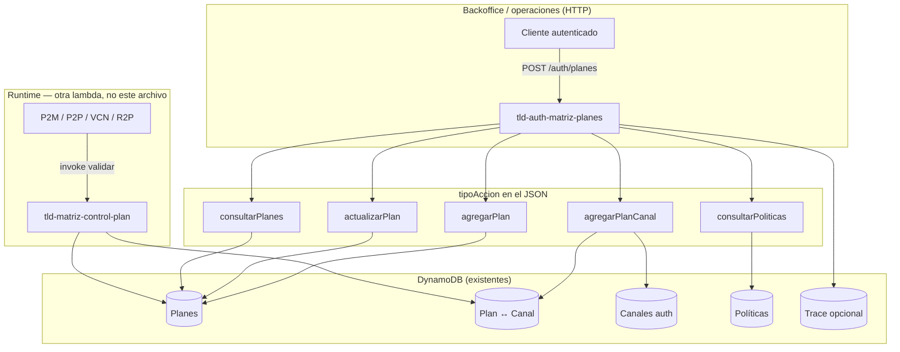

# `tld-auth-matriz-planes` — explicación para dummies

**Fecha:** 2026-07-04  
**Archivo:** `tld-matriz/lambdas/tld-auth-matriz-planes/index.js`  
**HTTP:** `POST /auth/planes` (API Gateway + authorizer TLD)

---

## En una frase

Es el **mostrador de planes de suscripción**: define qué planes existen, cuántas operaciones permiten, y **qué canal (banco/emisor) tiene contratado cuál plan**. No procesa pagos ni alias; solo **gestiona el catálogo y las suscripciones canal↔plan** en DynamoDB.

---

## Analogía

| Mundo real | En matriz |
|------------|-----------|
| Plan “mensual 10.000 consultas” | Fila en tabla **planes** (`tld-matriz-planes`) |
| “El banco X contrató ese plan” | Fila en tabla **plan–canal** (`tld-matriz-planes-canales`) |
| “¿Qué APIs/grupos existen?” | `consultarPoliticas` → tabla **políticas** |
| Lista de canales que pueden suscribirse | Tabla **canales auth** (`CANAL_TABLE`) |

La lambda **`tld-matriz-control-plan`** (otra) es el **portero en cada transacción** de P2M/P2P/VCN/R2P. **Esta** lambda es quien **da de alta** el plan y la suscripción.

---

## Diagrama general



---

## Flujo del handler (paso a paso)

```
1. Recibe event (API Gateway): body JSON + headers
2. Genera idTransaccionAutopista (desde IP + timestamp) — auditoría
3. Lee data = JSON.parse(event.body)
4. Exige data.tipoAccion
5. Valida campos según tipoAccion
6. getInvalidField(body) — tipos, longitudes, enums
7. Switch por tipoAccion → función DynamoDB
8. Responde SIEMPRE HTTP 200 con codigoError/statusCode DENTRO del body
```

---

## Las 5 acciones (`tipoAccion`)

### 1. `agregarPlan` — crear un plan en catálogo

**Entrada mínima:** `accion`, `request`, `planType`, `namePlan`

| Campo | Significado |
|-------|-------------|
| `namePlan` | Nombre comercial del plan |
| `planType` | Duración: semanal, quincenal, mensual, trimestral, semestral, anual |
| `request` | Cupo numérico (cuántas operaciones permite el plan) |
| `accion` | `alta` → activo, `baja` → inactivo |

Genera `idPlan` (UUID) y hace **Put** en `PLANS_TABLE`.

---

### 2. `actualizarPlan` — activar/desactivar un plan

**Entrada:** `idPlan`, `accion` (`alta`/`baja`)

**Update** de `estatus` en la tabla de planes.

---

### 3. `agregarPlanCanal` — suscribir un canal a un plan

**La más importante para negocio.**

**Entrada:** `idPlan`, `idCanal`, `accion` (`alta` / `baja`)

```
consultarPlanPorId(idPlan)     → ¿existe el plan?
consultarCanalPlanPorIdPlan    → ¿ya hay suscripción activa (alta)?
getAuthCanal()                 → ¿idCanal está en lista permitida?
calcularFechaFin(planType)     → cuándo vence la suscripción
addPlanCanal()                 → guarda en PLANS_CANALES_TABLE
guardarTrace()                 → auditoría en TABLE_MATRIZ_TRACE (si TTL_DELTA ≠ 0)
```

Contadores iniciales: `exitoso=0`, `fallido=0`, `bloqueado=0` (los incrementa **control-plan** en runtime).

---

### 4. `consultarPlanes` — listar catálogo

**Scan** de todos los planes → array con `planType`, `namePlan`, `request`, `idPlan`, `status`, etc.

---

### 5. `consultarPoliticas` — listar grupos de políticas

**Scan** de `POLITICAS_TABLE` excluyendo grupos `tld-matriz-default` y `tld-matriz-full` → nombres de grupo (APIs / permisos en matriz).

---

## Tablas / env que usa

| Variable env | Uso |
|--------------|-----|
| `DYNAMODB_PLANS_TABLE_NAME` | Catálogo de planes |
| `DYNAMODB_PLANS_CANALES_TABLE_NAME` | Suscripción canal ↔ plan |
| `DYNAMODB_POLITICAS_TABLE_NAME` | Grupos de políticas |
| `CANAL_TABLE` | Canales autorizados para suscribir |
| `TABLE_MATRIZ_TRACE` | Trazas con TTL |
| `PLANS_TYPE` | Lista permitida de `planType` (CSV en env) |
| `TTL_DELTA` | Segundos de TTL en trace; `0` = no guardar |
| `PRINT_LOGS` | `on` / off logs |

---

## Detalle que conviene conocer (código actual)

- **HTTP siempre 200** aunque haya error; el error va en `codigoError` / `descripcionError` en el body (patrón legacy matriz).
- **`calcularFechaFin`:** `mensual` usa **15 días** en código (posible bug o convención histórica; no asumir 30 sin confirmar negocio).
- **`consultarCanalPlanPorIdPlan`:** si no hay filas devuelve status 400 con mensaje “no encontrado”; la rama `agregarPlanCanal` trata `data.length === 0` como “puede dar alta”.
- Línea 166: `delete body.tipoAccion.delete` parece typo (`delete body.tipoAccion` sería lo esperado); no ejecutar cambios aquí — solo estudio.

---

## Dónde encaja en el ecosistema que ya vimos

```
Canal emisor
    → [ tld-matriz (auth/API keys) ]
    → [ tld-api-p2m | alias | cuenta-nombre | r2p ]
    → [ tld-validador-proxy ]
    → Canal validador
```

**`tld-auth-matriz-planes`** vive en la parte **matriz / administración**, antes del tráfico transaccional. **`plan.js`** en P2M/P2P/base habla con **`tld-matriz-control-plan`**, no con este endpoint HTTP.

Documentado en [02-validacion-plan-runtime.md](./02-validacion-plan-runtime.md).
