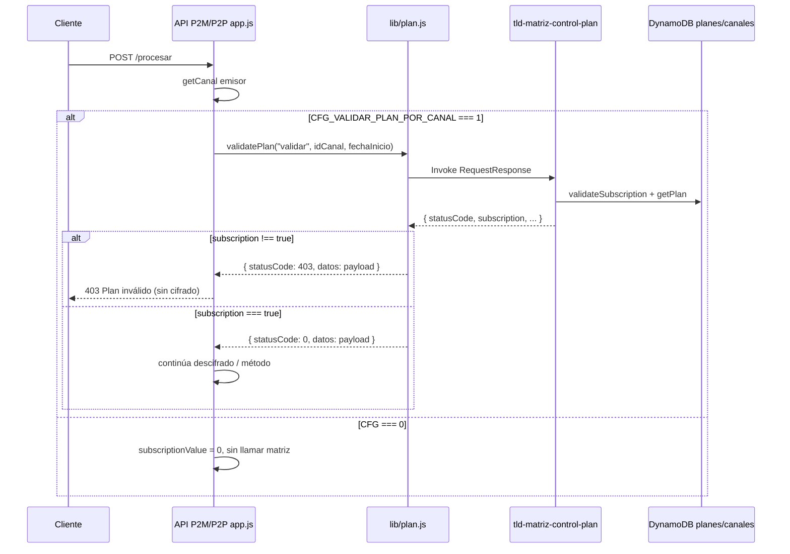

# Validación de plan en runtime (`plan.js` + `CFG_VALIDAR_PLAN_POR_CANAL`)

**Fecha:** 2026-07-04

## Qué problema había

Con `CFG_VALIDAR_PLAN_POR_CANAL=1`, las APIs **llamaban** a matriz (`tld-matriz-control-plan`) pero **no rechazaban** cuando el canal no tenía suscripción activa.

**Causa:** `lib/plan.js` devolvía siempre `statusCode: 0` tras la invocación Lambda, aunque control-plan respondiera `{ statusCode: 200, subscription: false }`. En `app.js` (`resolverCanalEmisor`) el corte solo ocurre si:

```javascript
resValPlan.statusCode !== 0 || planPayload?.statusCode !== 200
```

Un payload con `statusCode: 200` y `subscription: false` **no cumplía** ninguna condición → el flujo seguía como si el plan fuera válido.

**Contexto operativo:** el plan siempre se aprobaba en prod; se añadió `CFG_VALIDAR_PLAN_POR_CANAL` para poder desactivar la validación en P2P (`0`) mientras se corregía el bug sin riesgo inmediato en tráfico real.

## Corrección en `plan.js`

Archivos idénticos (misma lógica):

| Repo | Ruta |
|------|------|
| P2M | `tld-api-p2m/lambdas/p2m/lib/plan.js` |
| P2P | `tld-api-alias/lambdas/alias/lib/plan.js` |
| Base | `tld-api-base/lambdas/base/lib/plan.js` |

Con `estado === "validar"`, solo aprueba si el payload decodificado cumple **ambas** condiciones:

- `decodedPayload.statusCode === 200`
- `decodedPayload.subscription === true`

En cualquier otro caso (sin suscripción, cupo agotado con `statusCode: 99`, payload vacío, error de matriz) devuelve `statusCode: 403` en el contrato homologado de `validatePlan`.

Los modos `exitoso` y `fallido` no cambian: invocación `Event` (fire-and-forget) para tracking; no evalúan `subscription`.

## Interruptor de despliegue

| Variable | Valores | Dónde se lee |
|----------|---------|--------------|
| `CFG_VALIDAR_PLAN_POR_CANAL` | `0` = no llama matriz en peaje; `1` = llama `plan.validatePlan("validar", ...)` | `app.js` → `resolverCanalEmisor` |

Cuando vale `0`:

- No se invoca control-plan en el peaje.
- `subscriptionValue = 0`.
- `response.js` no registra tracking exitoso/fallido vía plan (solo si `subscriptionValue` es truthy).

### Valores en `template.yaml` (2026-07-04)

| API | Repo | `CFG_VALIDAR_PLAN_POR_CANAL` |
|-----|------|------------------------------|
| P2M | `tld-api-p2m` | `"1"` |
| P2P | `tld-api-alias` | `"1"` (antes `0`) |
| Base (lab) | `tld-api-base` | parámetro SAM `ValidarPlanPorCanal`, default `"0"` |
| VCN | `tld-api-cuenta-nombre` | **sin variable aún** — desalineado |

## Flujo completo



## Respuestas relevantes de control-plan

Referencia: `tld-matriz/lambdas/tld-matriz-control-plan/index.js`

| Escenario | Payload típico | Efecto tras fix en `plan.js` |
|-----------|----------------|------------------------------|
| Canal sin suscripción | `{ statusCode: 200, subscription: false }` | **403** (antes pasaba) |
| Cupo agotado | `{ statusCode: 99, subscription: false, description: "Transacción bloqueada" }` | **403** |
| Transacción permitida | `{ statusCode: 200, subscription: true }` | OK, continúa |
| Error matriz | `{ statusCode: 500, ... }` | **403** (por `statusCode !== 200` o `subscription !== true`) |

## Administración vs runtime

| Lambda | Rol |
|--------|-----|
| `tld-auth-matriz-planes` | Backoffice: catálogo, altas canal↔plan (`POST /auth/planes`) — ver [01-auth-matriz-planes-index.md](./01-auth-matriz-planes-index.md) |
| `tld-matriz-control-plan` | Portero por transacción; lo invoca `plan.js` — ver [04-control-plan-index.md](./04-control-plan-index.md) |

Variables de entorno en la API:

- `CFG_CONTROL_PLAN_FUNCTION_NAME` — default `tld-matriz-control-plan`
- `CFG_ALIAS_API_NAME` — nombre de la API en matriz (`tld-api-p2m`, `tld-api-alias`, etc.)

## Pruebas recomendadas (dev)

1. Deploy con `CFG_VALIDAR_PLAN_POR_CANAL=1`.
2. Canal **sin** plan asignado → debe responder 403 antes del descifrado.
3. Canal **con** plan activo y cupo → debe continuar el flujo normal.
4. Verificar logs `plan.validatePlan: validacion finalizada` con `planAprobado: false|true`.

## Referencias código

- Fix: [`../../tld-api-base/lambdas/base/lib/plan.js`](../../tld-api-base/lambdas/base/lib/plan.js)
- Peaje: [`../../tld-api-p2m/lambdas/p2m/app.js`](../../tld-api-p2m/lambdas/p2m/app.js) (`resolverCanalEmisor`)
- Control-plan (detalle handler): [04-control-plan-index.md](./04-control-plan-index.md)
- Control-plan (código): [`../../tld-matriz/lambdas/tld-matriz-control-plan/index.js`](../../tld-matriz/lambdas/tld-matriz-control-plan/index.js)
- Detalle transversal base: [../tld-api-base/08-lib-plan.md](../tld-api-base/08-lib-plan.md)
