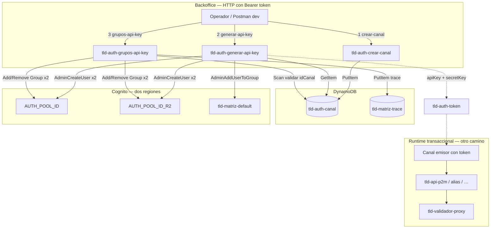
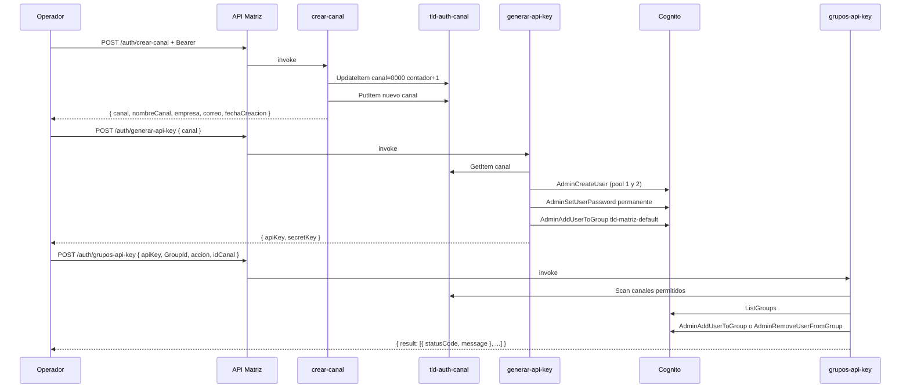
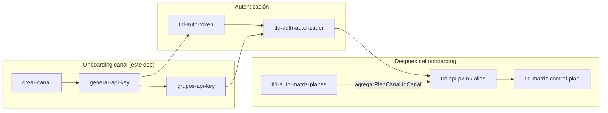

# Canales, API keys y grupos — explicación para dummies

**Fecha:** 2026-07-04  
**Lambdas:**

| Lambda | HTTP |
|--------|------|
| `tld-auth-crear-canal` | `POST /auth/crear-canal` |
| `tld-auth-generar-api-key` | `POST /auth/generar-api-key` |
| `tld-auth-grupos-api-key` | `POST /auth/grupos-api-key` |

**Auth en los tres:** Bearer token vía `TldAuthorizer` (Cognito). No son endpoints públicos.

---

## En una frase

Son el **trámite de identidad** de un banco/emisor en matriz: primero **registras el canal** (quién es), luego **generas credenciales** (apiKey + secretKey en Cognito), y opcionalmente **ajustas permisos** agregando o quitando **grupos** Cognito a esa apiKey.

Sin canal en DynamoDB no hay apiKey. Sin apiKey no hay token. Sin token (o con grupos insuficientes) no entras a las APIs TLD ni a los endpoints de administración.

---

## Analogía

| Paso | Mundo real | En matriz |
|------|------------|-----------|
| 1 | Abrir expediente del banco | `crear-canal` → fila en **`tld-auth-canal`** con `canal` = `"0001"`, `"0002"`, … |
| 2 | Entregar usuario y contraseña de acceso | `generar-api-key` → usuario Cognito (`apiKey`) + `secretKey` |
| 3 | Dar carnets de áreas (P2M, planes, admin…) | `grupos-api-key` → grupos Cognito (`tld-api-p2m`, `tld-matriz-full`, …) |
| 4 (otro doc) | Contratar plan de operaciones | `tld-auth-matriz-planes` → `agregarPlanCanal` |

El **`canal`** (ID numérico string, ej. `"0042"`) es el mismo identificador que después usan P2M/P2P como **`idCanal`** en las transacciones y en control de plan.

---

## Flujo que usaste en Desarrollo

```
┌─────────────────────────────────────────────────────────────────┐
│  Ya tienes token admin (usuario del pool con grupo tld-matriz-  │
│  full o permisos equivalentes)                                   │
└───────────────────────────────┬─────────────────────────────────┘
                                │
        ┌───────────────────────▼───────────────────────┐
        │  POST /auth/crear-canal                        │
        │  { nombreCanal, empresa, correo }              │
        │  → respuesta incluye canal: "000N"             │
        └───────────────────────┬───────────────────────┘
                                │
        ┌───────────────────────▼───────────────────────┐
        │  POST /auth/generar-api-key                    │
        │  { canal: "000N" }                             │
        │  → { apiKey, secretKey }  ← GUARDAR AHORA      │
        └───────────────────────┬───────────────────────┘
                                │
        ┌───────────────────────▼───────────────────────┐
        │  (Opcional) POST /auth/grupos-api-key          │
        │  { apiKey, GroupId: [...], accion, idCanal }   │
        │  → permisos extra más allá del grupo default   │
        └───────────────────────┬───────────────────────┘
                                │
        ┌───────────────────────▼───────────────────────┐
        │  POST /auth/token  (otra lambda)               │
        │  apiKey + secretKey → accessToken              │
        │  → llamar P2M / P2P / matriz / validador       │
        └────────────────────────────────────────────────┘
```

---

## Diagrama general (ecosistema)



---

## Secuencia detallada (las 3 lambdas)



---

## Patrón común de respuesta HTTP

Las tres lambdas siguen el **patrón legacy matriz**:

- **HTTP siempre 200** en API Gateway.
- Éxito o error van **dentro del body** (`codigoError` / `descripcionError` en fallo).

---

# 1. `tld-auth-crear-canal`

**Archivo:** `tld-matriz/lambdas/tld-auth-crear-canal/index.js`

## Qué hace

Da de alta un **nuevo canal de negocio** en la tabla `tld-auth-canal`. Asigna automáticamente el **`canal`** (ID) usando un contador atómico.

## Request

```json
{
  "nombreCanal": "BANCO EJEMPLO",
  "empresa": "BANCO EJEMPLO SA",
  "correo": "integracion@banco.ejemplo.pa"
}
```

| Campo | Validación |
|-------|------------|
| `nombreCanal` | string, 1–50 caracteres |
| `empresa` | string, 1–50 |
| `correo` | string, 1–50 |

## Qué escribe en DynamoDB

Tabla **`tld-auth-canal`** (hardcodeada en el código, no usa env `CANAL_TABLE`):

1. **`getSecuencia()`** — `UpdateItem` sobre la fila especial `canal = "0000"`, campo `contador += 1`.
2. **`guardarCanal()`** — `PutItem` con el nuevo registro:

| Campo asignado | Origen |
|----------------|--------|
| `canal` | contador (string, ej. `"0003"`) |
| `fechaCreacion` | timestamp America/Bogota (-05:00) |
| `nombreCanal`, `empresa`, `correo` | body |

## Response éxito

Devuelve el **objeto guardado completo**, incluyendo el `canal` generado:

```json
{
  "canal": "0003",
  "nombreCanal": "BANCO EJEMPLO",
  "empresa": "BANCO EJEMPLO SA",
  "correo": "integracion@banco.ejemplo.pa",
  "fechaCreacion": "2026-07-04 03:45:12"
}
```

## Errores típicos

| codigoError | Causa |
|-------------|-------|
| 400 | Campo inválido (`Error de formato en campo …`) |
| 550 | Fallo al guardar o excepción |

## Semilla inicial (`tld-auth-init`)

Al desplegar matriz, `tld-auth-init` crea la fila `canal = "0000"` con `contador: 1`. Sin esa fila, `getSecuencia()` falla y no se generan IDs.

---

# 2. `tld-auth-generar-api-key`

**Archivo:** `tld-matriz/lambdas/tld-auth-generar-api-key/index.js`

## Qué hace

Para un **`canal` ya existente**, crea un **usuario Cognito** cuyo username es la **apiKey** y cuya contraseña permanente es el **secretKey**. Replica la operación en **dos user pools** (región primaria y réplica `AUTH_POOL_ID_R2`).

## Request

```json
{
  "canal": "0003"
}
```

| Campo | Validación |
|-------|------------|
| `canal` | string, longitud 1–4 (debe existir en `tld-auth-canal`) |

## Flujo interno

```
getCanal(canal)           → GetItem tld-auth-canal
generarApiKey(canal)      → generateUUID('key')  → apiKey
                          → generateUUID('secret') → secretKey
                          → AdminCreateUser (pool 1 + pool 2)
                            atributos: name = "nombreCanal - canal"
                                       custom:canal = canal
                          → AdminSetUserPassword Permanent=true (x2)
asignarGrupoDefault()     → AdminAddUserToGroup DEFAULT_GROUP (x2)
```

## Response éxito

```json
{
  "apiKey": "a1b2c3d4e5f6789012345678901234ab",
  "secretKey": "xxxxxxxx1txxxx2exxx3lyxyxyxyexxxxxxxxxxxx4r..."
}
```

**Importante:** el secret se muestra **una sola vez** en esta respuesta. Cognito no lo vuelve a exponer.

## Grupo por defecto

Tras crear el usuario, se agrega al grupo **`tld-matriz-default`** (`DEFAULT_GROUP` en `template.yaml`).

Ese grupo tiene permisos **mínimos** (políticas en `tld-auth-politicas`). Para acceder a P2M, planes u otros recursos hay que **añadir grupos** con `grupos-api-key` o usar un usuario admin con `tld-matriz-full`.

## Variables de entorno (SAM)

| Variable | Uso |
|----------|-----|
| `AUTH_POOL_ID` | Pool Cognito región principal |
| `AUTH_POOL_ID_R2` | Pool réplica (segunda región) |
| `DEFAULT_GROUP` | `tld-matriz-default` |
| `R_AWS` | Región DynamoDB |

## `replicarUsuario.js` (no es el handler HTTP)

Script **manual** en el mismo directorio para migrar/replicar un usuario con `key` y `pass` ya conocidos a **una sola** región. No eliminar del repo; no usarlo como sustituto del endpoint en operación normal.

---

# 3. `tld-auth-grupos-api-key`

**Archivo:** `tld-matriz/lambdas/tld-auth-grupos-api-key/index.js`

## Qué hace

**Alta o baja** de uno o más **grupos Cognito** sobre una **apiKey** existente. Los grupos determinan qué ARNs de API Gateway puede invocar el token (vía `tld-auth-autorizador` + tabla `tld-auth-politicas`).

## Request

```json
{
  "apiKey": "a1b2c3d4e5f6789012345678901234ab",
  "GroupId": ["tld-api-p2m", "tld-api-alias"],
  "accion": "alta",
  "idCanal": "0003"
}
```

| Campo | Validación | Notas |
|-------|------------|-------|
| `apiKey` | string no vacío | Username en Cognito |
| `GroupId` | array no vacío | Nombres de grupo Cognito |
| `accion` | `"alta"` o `"baja"` | case insensitive |
| `idCanal` | **no validado en getInvalidField** | Debe existir en scan de `tld-auth-canal`; si no → 400 «Canal … no permitido» |

## Flujo interno

```
Generar idTransaccionAutopista + fechaHora (auditoría)
guardarTrace() → tld-matriz-trace (si TTL_DELTA ≠ 0)
getAllGroups() → ListGroups en AUTH_POOL_ID
getAuthCanal() → Scan CANAL_TABLE
validateAllowedCanales(idCanal)
  accion === "alta"  → addGroupToUser (Cognito x2 por grupo)
  accion === "baja"  → removeGroupToUser (Cognito x2 por grupo)
```

Cada grupo se valida contra la lista real de Cognito (`validateAllowedGroup`). Grupo inexistente → mensaje por ítem en `result`, no necesariamente error global.

## Response éxito

```json
{
  "result": [
    {
      "statusCode": 200,
      "message": "Grupo tld-api-p2m asignado satisfactoriamente"
    },
    {
      "statusCode": 200,
      "message": "Grupo tld-api-alias asignado satisfactoriamente"
    }
  ]
}
```

## Grupos habituales (consultar en dev)

Usar `consultarPoliticas` en `tld-auth-matriz-planes` o revisar Cognito / `tld-auth-politicas`. Ejemplos frecuentes:

| Grupo | Rol aproximado |
|-------|----------------|
| `tld-matriz-default` | Mínimo; asignado al generar apiKey |
| `tld-matriz-full` | Admin matriz (crear-canal, generar-api-key, …) |
| `tld-api-p2m` | Invocar API P2M |
| `tld-api-alias` | Invocar API P2P |
| Otros | Según políticas sembradas en init |

## Variables de entorno (SAM)

| Variable | Uso |
|----------|-----|
| `AUTH_POOL_ID` / `AUTH_POOL_ID_R2` | Cognito |
| `CANAL_TABLE` | `tld-auth-canal` |
| `TABLE_MATRIZ_TRACE` | Auditoría |
| `TTL_DELTA` | Segundos TTL trace (`365` en template; `0` = no guardar) |
| `DEFAULT_GROUP` | Referencia (no usada en handler principal) |

---

## Cómo encajan con el resto del ecosistema



| Paso posterior | Requiere |
|----------------|----------|
| `POST /auth/token` con apiKey/secret | apiKey generada |
| Llamar `POST /procesar` en P2M/P2P | Token + grupo `tld-api-p2m` o `tld-api-alias` + canal configurado en validador |
| `agregarPlanCanal` | `idCanal` registrado en `tld-auth-canal` |
| Validación de plan en transacción | Suscripción activa (doc [02-validacion-plan-runtime.md](./02-validacion-plan-runtime.md)) |

---

## Checklist rápido — nuevo canal en Dev

1. **Token admin** — usuario con permiso a `crear-canal` y `generar-api-key` (grupo `tld-matriz-full` o equivalente).
2. **`POST /auth/crear-canal`** — anotar `canal` devuelto.
3. **`POST /auth/generar-api-key`** — guardar `apiKey` y `secretKey` en lugar seguro.
4. **`POST /auth/grupos-api-key`** — `accion: "alta"`, grupos según APIs a probar (`tld-api-p2m`, `tld-api-alias`, …).
5. **`POST /auth/token`** — obtener `accessToken`.
6. **Validador** — alta del canal emisor en tablas validador (fuera de matriz; repo P2M/P2P).
7. **Plan (opcional)** — `agregarPlanCanal` si `CFG_VALIDAR_PLAN_POR_CANAL=1`.

---

## Detalles del código (sin modificar — solo estudio)

- **`crear-canal`:** tabla Dynamo hardcodeada `"tld-auth-canal"` aunque SAM define `CANAL_TABLE`.
- **`generar-api-key`:** IDs aleatorios custom (`generateUUID`); no es UUID estándar v4.
- **`grupos-api-key`:** `forEach` async sobre grupos — patrón frágil; funciona en la práctica pero no es `for…of` secuencial.
- **`grupos-api-key`:** trace usa `tipo: "planes"` (herencia de copy-paste desde matriz-planes).
- **Réplica dual:** casi toda operación Cognito se ejecuta en **pool 1 y pool 2**; fallo en uno deja estado inconsistente entre regiones.

---

## Referencias código

- [`../../tld-matriz/lambdas/tld-auth-crear-canal/index.js`](../../tld-matriz/lambdas/tld-auth-crear-canal/index.js)
- [`../../tld-matriz/lambdas/tld-auth-generar-api-key/index.js`](../../tld-matriz/lambdas/tld-auth-generar-api-key/index.js)
- [`../../tld-matriz/lambdas/tld-auth-grupos-api-key/index.js`](../../tld-matriz/lambdas/tld-auth-grupos-api-key/index.js)
- Doc repo detallada: `tld-matriz/docs/architecture/tld-auth-matriz/lambdas-tld-auth.md` §5–7
- Planes canal: [01-auth-matriz-planes-index.md](./01-auth-matriz-planes-index.md)
- Runtime plan: [02-validacion-plan-runtime.md](./02-validacion-plan-runtime.md)
