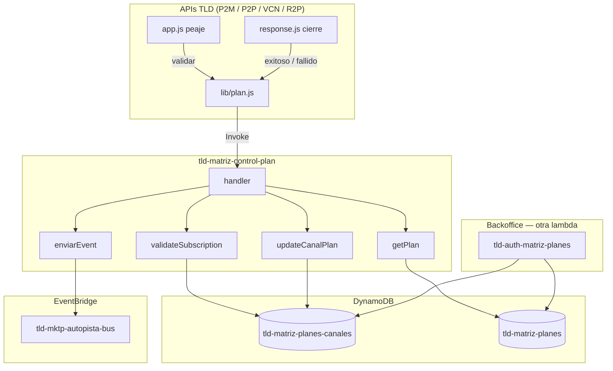
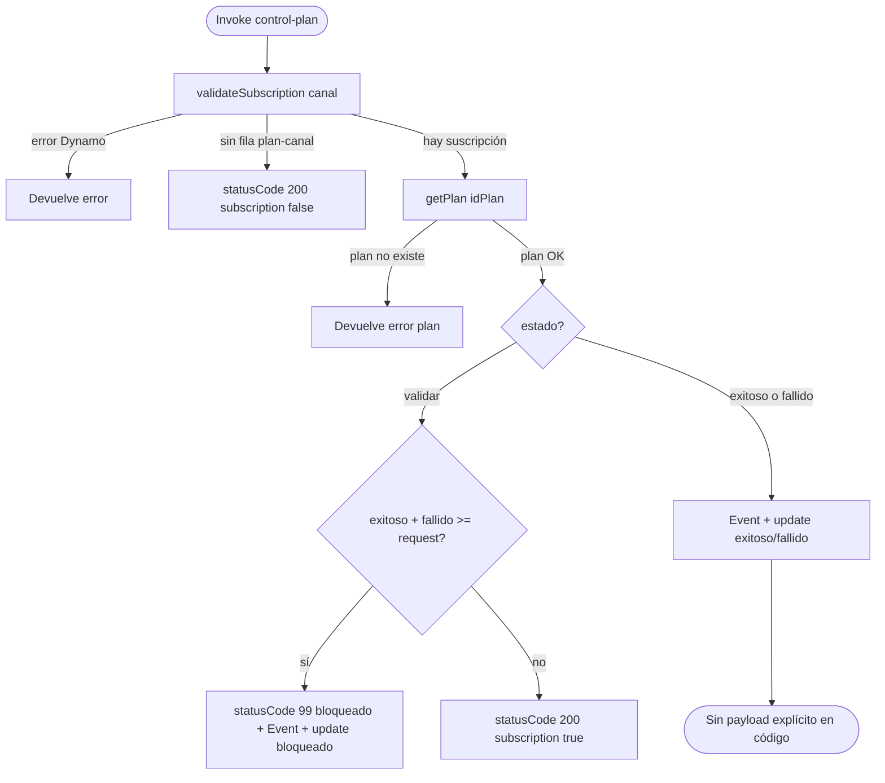
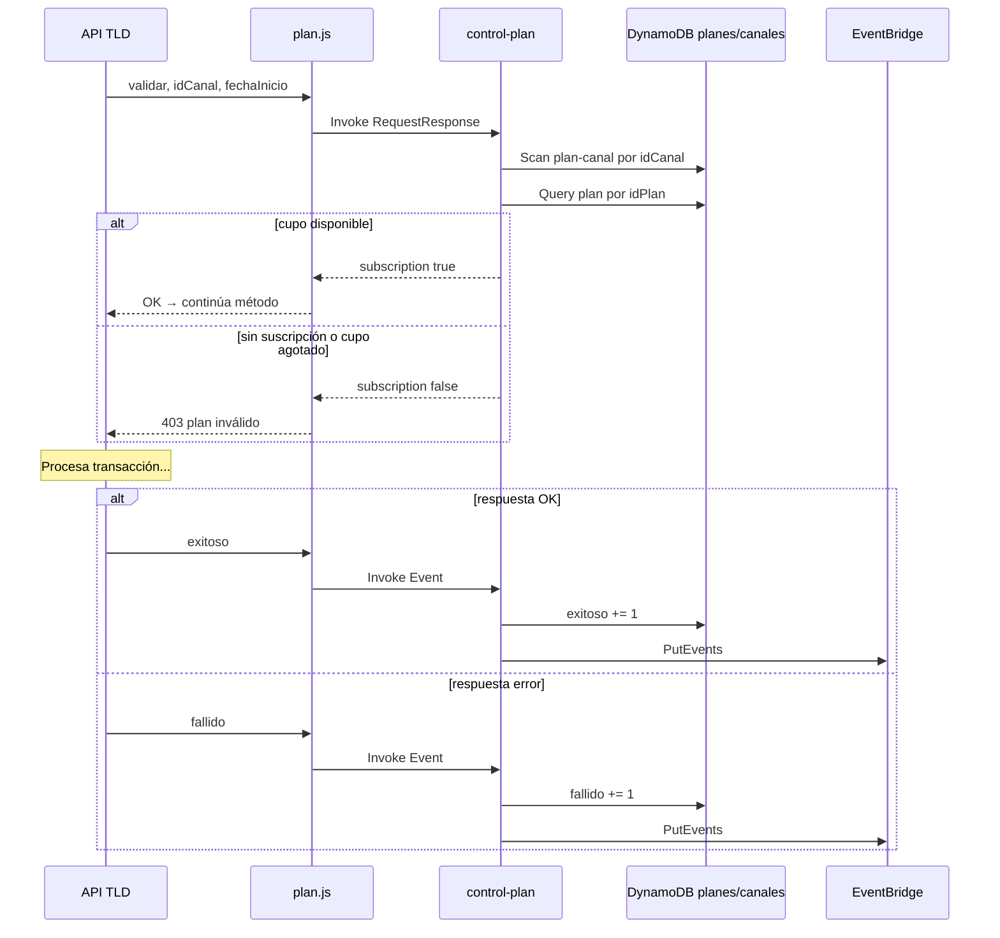
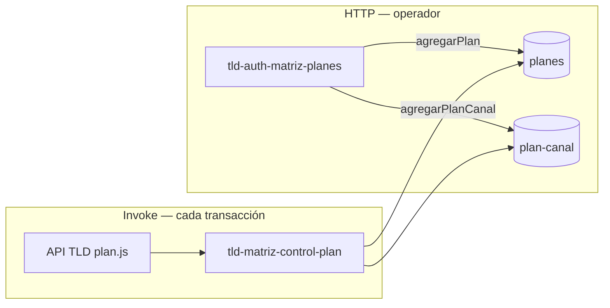

# `tld-matriz-control-plan`

**Fecha:** 2026-07-04  
**Archivo:** `tld-matriz/lambdas/tld-matriz-control-plan/index.js`  
**Invocación:** Lambda directa (no HTTP). La llaman P2M, P2P, VCN y R2P vía `lib/plan.js`.

---

## En una frase

Es el **portero de cupo** en cada transacción: cuando un canal emisor intenta operar, esta lambda revisa si **tiene plan contratado**, si **aún le quedan operaciones** en el periodo, y al terminar la transacción **suma** exitosa, fallida o bloqueada. No crea planes ni suscripciones; eso lo hace **`tld-auth-matriz-planes`**.

---

## Analogía

| Momento | Mundo real | En matriz |
|---------|------------|-----------|
| Antes de entrar al local | “¿Tienes membresía activa?” | `estado: validar` |
| Al salir contento | “Consumiste 1 visita exitosa” | `estado: exitoso` |
| Al salir con problema | “Consumiste 1 visita fallida” | `estado: fallido` |
| Sin cupo | “Membresía agotada — no pasas” | `statusCode: 99`, `subscription: false` |
| Sin contrato | “No estás suscrito” | `subscription: false` |

El **mostrador** que vende la membresía es [01-auth-matriz-planes-index.md](./01-auth-matriz-planes-index.md). Este archivo es el **control en la puerta**.

---

## Quién la llama y cómo

No hay `POST /auth/...` para esta lambda. La invoca **`plan.validatePlan(estado, idCanal, fechaInicio)`** en cada API TLD:

| `estado` en `plan.js` | InvocationType | Cuándo |
|----------------------|----------------|--------|
| `validar` | `RequestResponse` | Peaje en `app.js`, antes del descifrado (si `CFG_VALIDAR_PLAN_POR_CANAL=1`) |
| `exitoso` | `Event` | Tras respuesta OK al cliente (`response.js`) |
| `fallido` | `Event` | Tras respuesta de error al cliente |

Payload que recibe control-plan (desde `plan.js`):

```json
{
  "body": {
    "data": {
      "nombreApi": "tld-api-p2m",
      "estado": "validar",
      "canal": "1008",
      "fechaInicio": 1710000000123
    }
  }
}
```

| Campo | Origen |
|-------|--------|
| `nombreApi` | `CFG_ALIAS_API_NAME` del deploy (P2M, P2P, etc.) |
| `estado` | `validar` \| `exitoso` \| `fallido` |
| `canal` | `idCanal` del body de la transacción |
| `fechaInicio` | Timestamp al iniciar el handler en `app.js` (para latencia) |

Detalle del cableado API ↔ `plan.js`: [02-validacion-plan-runtime.md](./02-validacion-plan-runtime.md).

---

## Diagrama general



---

## Los 3 modos (`data.estado`)



### 1. `validar` — ¿puede pasar esta transacción?

```
validateSubscription(canal)
  → Scan tld-matriz-planes-canales WHERE idCanal = canal
  → ¿Hay fila?  NO → { statusCode: 200, subscription: false }
  → ¿Hay fila?  SÍ → getPlan(idPlan)
  → totalRequest = exitoso + fallido
  → ¿totalRequest >= plan.request?
        SÍ → bloqueado (+1), EventBridge, { statusCode: 99, subscription: false }
        NO → { statusCode: 200, subscription: true, description: "Transacción permitida" }
```

Es la respuesta que **`plan.js`** evalúa para permitir o rechazar el flujo (tras el fix de 2026-07-04).

### 2. `exitoso` — consumir cupo por transacción OK

```
getPlan → updateCanalPlan(..., 'exitoso')  → exitoso += 1
enviarEvent → EventBridge (telemetría)
```

Invocación **asíncrona** (`Event`): la API no espera el resultado.

### 3. `fallido` — registrar intento fallido

Igual que exitoso, pero `fallido += 1`.

---

## Secuencia completa (una transacción P2M/P2P)



---

## Tablas DynamoDB

| Tabla | Env | Lectura / escritura |
|-------|-----|---------------------|
| **Planes** | `DYNAMODB_PLANS_TABLE_NAME` | `getPlan` — cupo máximo (`request`), `planType`, `namePlan` |
| **Plan ↔ canal** | `DYNAMODB_PLANS_CANALES_TABLE_NAME` | `validateSubscription` (scan), `updateCanalPlan` (contadores) |

### Fila plan–canal (suscripción)

Campos que usa control-plan:

| Campo | Uso |
|-------|-----|
| `idCanal` | Buscar suscripción del emisor |
| `idPlan` | Enlazar al catálogo de planes |
| `idPlanCanal` | Clave para `updateCanalPlan` |
| `exitoso`, `fallido`, `bloqueado` | Contadores del periodo |
| `fechaFin`, `fechaHora`, `estatus` | Metadata (se reescriben en update sin recalcular fechaFin aquí) |

Los contadores arrancan en **0** cuando `agregarPlanCanal` da de alta la suscripción ([01](./01-auth-matriz-planes-index.md)).

### Fila plan (catálogo)

| Campo | Uso en control-plan |
|-------|---------------------|
| `request` | Cupo máximo: `exitoso + fallido` no puede superarlo en `validar` |
| `planType`, `namePlan`, `estatus` | Consultados; el cupo manda en runtime |

---

## Respuestas típicas (`validar`)

| Situación | Payload devuelto | Efecto en API (con fix `plan.js`) |
|-----------|------------------|-----------------------------------|
| Canal sin fila en plan–canal | `{ statusCode: 200, subscription: false, message: "Canal no posee suscripción" }` | **403** |
| Cupo agotado | `{ statusCode: 99, subscription: false, description: "Transacción bloqueada" }` | **403** |
| Cupo OK | `{ statusCode: 200, subscription: true, description: "Transacción permitida" }` | Continúa |
| Error Dynamo / plan | `statusCode` 400, 500, etc. | **403** |
| Excepción no controlada | `{ statusCode: 500, message: "Error inesperado" }` | **403** |

Para `exitoso` / `fallido` el handler **no devuelve** un objeto de éxito explícito en el código actual; con `Event` eso no afecta al cliente.

---

## EventBridge (telemetría)

Función **`enviarEvent`**: publica en el bus **`tld-mktp-autopista-bus`**.

| Campo Detail | Contenido |
|--------------|-----------|
| `nombreApi` | API que originó la transacción |
| `estado` | `validar` → puede quedar como `bloqueado`; tracking → `exitoso` / `fallido` |
| `latencia` | ms entre `fechaInicio` (API) y ahora |
| `fechaTransaccion` | ISO timestamp |
| `region` | `AWS_REGION` |
| `canal` | idCanal |
| `plan` | idPlan |

Se envía en **bloqueo por cupo** y en **tracking exitoso/fallido**.

---

## Variables de entorno (SAM)

| Variable | Uso |
|----------|-----|
| `DYNAMODB_PLANS_TABLE_NAME` | Tabla catálogo planes |
| `DYNAMODB_PLANS_CANALES_TABLE_NAME` | Tabla suscripción canal↔plan |
| `TTL_DELTA` | Declarada en template; **no usada** en este `index.js` |
| `PRINT_LOGS` | `on` → logs |
| `AWS_REGION` | EventBridge detail |

La lambda corre en **VPC** (template SAM) con permisos DynamoDB + `events:PutEvents`.

---

## Relación admin ↔ runtime



| Pregunta | Lambda |
|----------|--------|
| ¿Existe el plan “10.000 ops/mes”? | `tld-auth-matriz-planes` |
| ¿El canal 1008 contrató ese plan? | `tld-auth-matriz-planes` → `agregarPlanCanal` |
| ¿El canal 1008 puede hacer **esta** operación ahora? | **`tld-matriz-control-plan`** → `validar` |
| ¿Sumar 1 exitosa/fallida tras responder? | **`tld-matriz-control-plan`** → `exitoso` / `fallido` |

---

## Flujo del handler (paso a paso)

```
1. Recibe event (Invoke Lambda): body.data con canal, estado, nombreApi, fechaInicio
2. validateSubscription(canal) — Scan plan-canal
3. Si statusCode ≠ 200 → devolver error
4. Si subscription === false → devolver (sin plan)
5. getPlan(idPlan) — Query catálogo
6. Si estado === 'validar':
     a. total = exitoso + fallido
     b. Si total >= plan.request → bloqueado, evento, update, return 99
     c. Si no → return 200 subscription true
7. Si estado === 'exitoso' | 'fallido':
     a. updateCanalPlan (+1 contador)
     b. enviarEvent (telemetría)
     c. (sin return explícito en código)
8. Si plan inválido → return error de getPlan
9. catch → statusCode 500
```

---

## Detalles del código (solo estudio — no modificar aquí)

- **`validateSubscription`** usa **Scan** con filtro por `idCanal`, no Query por índice; toma **`Items[0]`** si hay varias filas.
- Considera suscripción activa si **existe cualquier fila** para el canal; **no** revalida `estatus` ni `fechaFin` en esta lambda.
- En rama **bloqueado**, `updateCanalPlan` se llama **sin `await`** (línea 41) — el incremento puede quedar en vuelo.
- En rama **exitoso/fallido**, `enviarEvent` también va **sin `await`** (línea 63).
- Variable global `tipoTransaccion` en bloqueo sin `let`/`const` (implícito global en módulo).
- **`validar`** compara `exitoso + fallido` con `plan.request`; **`bloqueado` no entra** en esa suma para el peaje.

---

## Prerrequisitos para que `validar` apruebe en dev

1. Canal en `tld-auth-canal` ([03-auth-canal-api-key-grupos.md](./03-auth-canal-api-key-grupos.md)).
2. Plan en catálogo (`agregarPlan` en matriz-planes).
3. Suscripción activa (`agregarPlanCanal` con `accion: alta`).
4. `CFG_VALIDAR_PLAN_POR_CANAL=1` en el deploy de la API.
5. Cupo: `exitoso + fallido < plan.request`.

---

## Referencias código

- Handler: [`../../tld-matriz/lambdas/tld-matriz-control-plan/index.js`](../../tld-matriz/lambdas/tld-matriz-control-plan/index.js)
- Invocador: [`../../tld-api-base/lambdas/base/lib/plan.js`](../../tld-api-base/lambdas/base/lib/plan.js)
- Admin planes: [01-auth-matriz-planes-index.md](./01-auth-matriz-planes-index.md)
- Fix peaje API: [02-validacion-plan-runtime.md](./02-validacion-plan-runtime.md)
