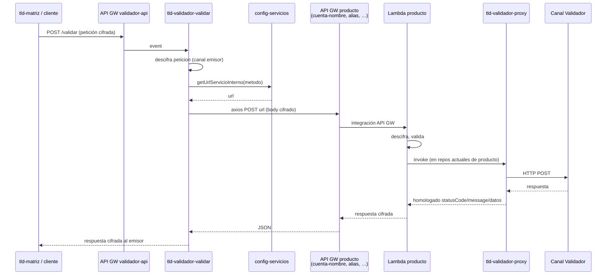
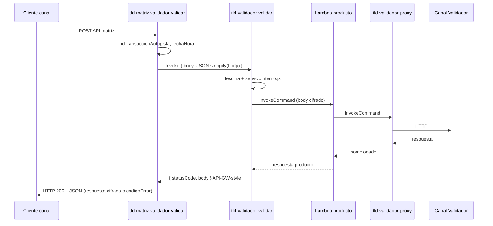

# Cadena de comunicación — desde `tld-validador-api`

## Vista prod (axios)



## Vista dev (invoke) — con matriz como caller



Ver [respuesta-a-matriz.md](./respuesta-a-matriz.md) para tipos de `body` (éxito / error / error cifrado).

## Capas de invoke en la plataforma (dev)

| Orden | Caller | Callee | Mecanismo |
|-------|--------|--------|-----------|
| 0 | Cliente canal | `tld-matriz` `validador-validar` | HTTP API matriz |
| 1 | Matriz | `tld-validador-validar` | **Invoke** (dev) o HTTP `/validar` (prod) |
| 2 | `tld-validador-validar` | `tld-cuenta-nombre` / alias / R2P / P2M | **Lambda Invoke** (dev) o axios a API producto (prod) |
| 3 | Lambda producto | `tld-validador-proxy` | **Lambda Invoke** (`PROX_VAL_LAMBDA_NAME`) |
| 4 | `tld-validador-proxy` | Canal Validador (banco/dummy) | **HTTP** (axios o cliente CA) |

`tld-validador-api` solo controla la **capa 2**. No conoce `tld-validador-proxy`.

## Timeouts que se encadenan (ejemplo VCN método 0001)

| Lambda | Timeout deploy reciente | Notas |
|--------|-------------------------|-------|
| `tld-validador-validar` | **28 s** (dev, jul-2026) | Debe cubrir invoke al producto (~20 s) + trabajo propio |
| `tld-cuenta-nombre` | **20 s** (dev, jul-2026) | Debe cubrir invoke al proxy |
| `tld-validador-proxy` | **15 s** | HTTP read 10 s + margen |
| Dummy demora | 16 s sleep | Provoca 599 en proxy |

Si el flujo entra por **validador-api** → cuenta-nombre → proxy, el presupuesto de **28 s** de `validar` debe cubrir el invoke encadenado más descifrado propio. Ver [timeouts-y-dependencias.md](./timeouts-y-dependencias.md).

## Payload en el invoke (capa 2)

Objeto enviado a la lambda producto (igual prod axios y dev invoke):

```json
{
  "idCanal": "<emisor>",
  "validador": "<canal validador>",
  "peticion": "<string cifrado>",
  "idTransaccionAutopista": "...",
  "fechaHora": "..."
}
```

La lambda producto espera evento tipo API Gateway o invoke directo según su `response.salidaLambda` / parser de entrada.
