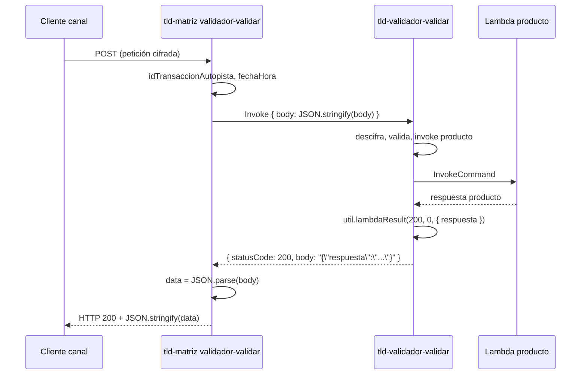

# Cómo `tld-validador-api` responde a matriz

Foco: **dev** (`tld-validador-api` + `tld-matriz`). Referencia: **prod** (`prod/tld-validador-api-main` + `prod/tld-matriz-main`).

---

## Quién llama a quién

| Capa | Prod | Dev |
|------|------|-----|
| Cliente → matriz | API matriz `validador-validar` | Igual |
| Matriz → validador-api | **HTTP** `axios.post(VALIDADOR_URL + "/validar", body)` | **Lambda Invoke** `VALIDADOR_LAMBDA_NAME` (`tld-validador-validar`) |
| Payload al validador | JSON plano `{ idCanal, validador, peticion, idTransaccionAutopista, fechaHora }` | Igual (matriz enriquece con `idTransaccionAutopista` y `fechaHora` antes de llamar) |
| Evento simulado (dev) | N/A | `{ body: JSON.stringify(body) }` — misma forma que API Gateway |

Archivos guía:

- Matriz prod: `prod/tld-matriz-main/lambdas/tld-validador-validar/index.js`
- Matriz dev: `tld-matriz/lambdas/tld-validador-validar/index.js`
- Validador prod: `prod/tld-validador-api-main/lambdas/validar/app.js` + `lib/util.js`
- Validador dev: `tld-validador-api/lambdas/validar/app.js` + `lib/util.js`

---

## Contrato de salida de `tld-validador-validar`

Toda respuesta pasa por **`util.lambdaResult(httpStatus, codigoError, mensaje)`** (idéntico en prod y dev):

```5:17:c:\Users\Lenovo\GitHub\tld-validador-api\lambdas\validar\lib\util.js
  lambdaResult: async function (httpStatus, codigoError, mensaje) {
    let lambdaResult = {};
    if (codigoError != 0) {
      lambdaResult = {
        statusCode: httpStatus,
        body: JSON.stringify({ codigoError: codigoError, mensajeError: mensaje }),
      };
    } else {
      lambdaResult = {
        statusCode: httpStatus,
        body: JSON.stringify(mensaje),
      };
    }
```

Es el formato **proxy de API Gateway**: `{ statusCode, body }` donde `body` es **string JSON**.

### Tipo A — Éxito de negocio (`codigoError === 0`)

```json
{
  "statusCode": 200,
  "body": "{\"respuesta\":\"<paquete cifrado para el canal emisor>\"}"
}
```

`mensaje` que se serializa es `{ respuesta: r }`, con `r` = respuesta del producto (típicamente JSON en claro del validador bancario, envuelto en cifrado hacia el emisor).

Origen en dev `app.js`:

```178:186:c:\Users\Lenovo\GitHub\tld-validador-api\lambdas\validar\app.js
    const r = respuesta?.respuesta ?? respuesta;
    const resp = { respuesta: r };
    return await util.lambdaResult(200, 0, resp);
```

Prod hace lo mismo (`respuesta?.respuesta ?? respuesta`).

### Tipo B — Error de negocio explícito (`codigoError !== 0`)

```json
{
  "statusCode": 200,
  "body": "{\"codigoError\":509,\"mensajeError\":\"Error inesperado al llamar servicio interno\"}"
}
```

o con HTTP 400 en validaciones de entrada:

```json
{
  "statusCode": 400,
  "body": "{\"codigoError\":401,\"mensajeError\":\"Canal emisor no existe\"}"
}
```

Códigos frecuentes hacia matriz (dev `app.js`):

| `httpStatus` | `codigoError` | Cuándo |
|--------------|---------------|--------|
| 400 | 400 | JSON/petición/idPeticion inválido |
| 400 | 401 | Canal emisor no existe |
| 400 | 402 | Canal validador no disponible |
| 400 | 404 | Validador no existe |
| 400 | 405 | Error descifrado canal emisor |
| 400 | 418 | Método no soportado (resolver servicio) |
| 500 | 509 | Fallo invoke producto / resolver servicio |
| 200 | 509 | Fallo invoke producto (invoke devolvió null) |
| 400 | 500 | Fallo `getCanal` (emisor/validador) — mensaje «Error interno» |
| 200 | 500 | Catch global `app.js` — «Error interno» (antes dig/prod usaban **999** «Error en la solicitud» en esta capa) |

### Tipo C — Error en solicitudes, pero HTTP 200 y `codigoError` 0 en el sobre

Validación de `solicitudes` / `idSolicitud`: el error va **dentro del paquete cifrado**, no en el sobre HTTP:

```131:141:c:\Users\Lenovo\GitHub\tld-validador-api\lambdas\validar\app.js
      const respuesta = { codigoError: resValSolicitudes.statusCode, mensajeError: resValSolicitudes.mensaje };
      const respuestaCifrada = {
        respuesta: await operacionesPaquete.cerrarPaquete(...),
      };
      return await util.lambdaResult(200, 0, respuestaCifrada);
```

Matriz recibe `{ respuesta: "<cifrado>" }` con `statusCode` 200; el canal emisor debe descifrar para ver `codigoError` 404/425/etc.

---

## Cómo matriz interpreta la respuesta

### Dev — invoke (`tld-matriz`)

```39:47:c:\Users\Lenovo\GitHub\tld-matriz\lambdas\tld-validador-validar\index.js
  const parsed = JSON.parse(new TextDecoder().decode(out.Payload));
  const status = parsed.statusCode;
  let data;
  if (typeof parsed.body === "string" && parsed.body.length > 0) {
    data = JSON.parse(parsed.body);
  } else {
    data = parsed.body;
  }
  return { status, data };
```

- `status` = `parsed.statusCode` del validador-api.
- `data` = JSON interno del `body` (objeto ya parseado).

**Reglas de matriz hacia su cliente:**

| Condición | HTTP matriz | Body al cliente |
|-----------|-------------|-----------------|
| Validación local matriz (`isValid`) | 200 | `{ codigoError: 400, descripcionError: "..." }` |
| `validarResponse.status == 400` | 200 | `data` del validador tal cual (`codigoError`, `mensajeError`) |
| `validarResponse.status !== 200` | catch → 200 | `{ codigoError: 550, descripcionError: "Error inesperado" }` |
| `FunctionError` en invoke | catch → 200 | 550 |
| Éxito (`status === 200`) | 200 | `data` del validador (típ. `{ respuesta: "..." }`) |

Matriz **casi siempre** responde HTTP **200** al cliente externo; el código de negocio va en el JSON (`codigoError` / paquete cifrado).

### Prod — axios (`tld-matriz-main`)

```55:68:c:\Users\Lenovo\GitHub\prod\tld-matriz-main\lambdas\tld-validador-validar\index.js
    const validarResponse = await axios.post(url, body,{timeout:TIMEOUT_VALUE})
    return {
      statusCode: 200,
      body: JSON.stringify(validarResponse.data),
    };
```

- `validarResponse.data` = cuerpo JSON que API Gateway expuso (ya parseado por axios).
- **No** desempaqueta `{ statusCode, body }` — API Gateway ya aplicó el proxy: HTTP status = `statusCode` lambda, body = string `body` parseado.

Equivalencia:

| Prod (axios + API GW) | Dev (invoke directo) |
|-----------------------|----------------------|
| `response.status` | `parsed.statusCode` |
| `response.data` | `JSON.parse(parsed.body)` |

Dev añade comprobación explícita `status !== 200` antes del éxito; prod en el camino feliz **no** la tiene (un 400 del validador con axios igual llega como `data` con matriz HTTP 200, salvo catch si axios lanzara).

---

## Diagrama respuesta (dev)



---

## Timeouts en la frontera matriz ↔ validador-api

| Componente | Prod | Dev |
|------------|------|-----|
| Matriz cliente | `TIMEOUT_VALUE` **29 s** | **29 s** |
| `tld-validador-validar` | **24 s** | **28 s** (fix 2026-07-06) |

Matriz espera más que dura el validador-api. Si el validador hace timeout, matriz puede recibir `FunctionError` o **550**.

Cadena completa: [timeouts-y-dependencias.md](./timeouts-y-dependencias.md).

---

## Cambio de transporte: impacto en la respuesta

**Ninguno en el contrato hacia matriz**, si se mantiene:

1. El handler de `tld-validador-validar` sigue devolviendo `util.lambdaResult` (forma API GW).
2. Matriz dev simula `event.body` como lo haría API Gateway.

Lo que cambió es **solo cómo matriz llega** al validador (URL → invoke). El **contenido** de `statusCode` + `body` que produce `tld-validador-api` es el mismo patrón prod/dev.

Lo que cambió **dentro** del validador-api es hacia el producto (axios → invoke a `tld-cuenta-nombre`, etc.); eso afecta qué trae `r` en el éxito o qué `codigoError` sale en el Tipo B, no el sobre hacia matriz.

---

## Ejemplos concretos hacia matriz

### Éxito método 0001

Matriz recibe (tras parsear):

```json
{
  "respuesta": "a1b2c3....<cifrado AES/RSA del canal emisor>"
}
```

### Fallo invoke producto (dev)

Validador-api:

```json
{ "statusCode": 200, "body": "{\"codigoError\":509,\"mensajeError\":\"Error inesperado al llamar servicio interno\"}" }
```

Matriz reenvía al cliente HTTP 200 con ese objeto en el body.

### Canal emisor inexistente

```json
{ "statusCode": 400, "body": "{\"codigoError\":401,\"mensajeError\":\"Canal emisor no existe\"}" }
```

Matriz dev: detecta `status == 400`, responde HTTP 200 con `{ codigoError: 401, mensajeError: "..." }`.

---

## Diferencias menores prod vs dev (validador-api → matriz)

| Tema | Prod | Dev |
|------|------|-----|
| `lambdaResult` / sobre | Igual | Igual |
| Mensajes error | Texto fijo en `app.js` | Igual semántica, más logging |
| `getCanal` | Retorna objeto o null | Retorna `{ statusCode, datos }` — mismos códigos al llamar `lambdaResult` |
| Bitácora en `lambdaResult` | Parámetro `bitacora` en algunas llamadas prod | Dev pasa `bitacora` pero `util.lambdaResult` **no la usa** (3 args) |

---

## Relación con Newman VCN

Newman llama **directo** al API de `tld-cuenta-nombre`, no pasa por matriz ni `tld-validador-api`. El contrato `{ respuesta: cifrado }` / `{ codigoError, mensajeError }` del producto es el mismo que el validador-api espera del invoke al producto y luego reenvía cifrado a matriz en el camino orquestado.
