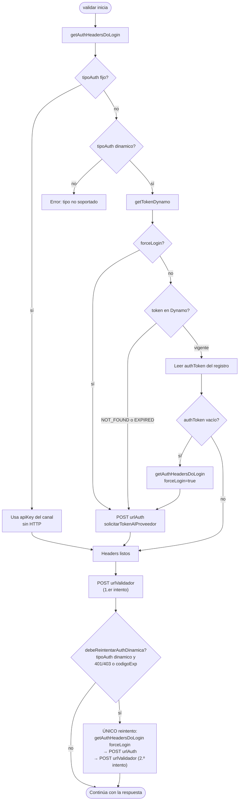

# Timeout al llamar al Canal Validador

Estudio de `tld-validador-proxy`.

**Fuentes:** `lambdas/`, `template.yaml`, `samconfig.toml`. No se usó `tld-validador-proxy/docs/`.

---

## 1. Configuración (AWS)

| Parámetro | Valor | Archivo |
|-----------|-------|---------|
| `HTTP_READ_TIME_OUT` | `10000` ms | `template.yaml` L250 |
| Timeout Lambda (función) | `11` s | `template.yaml` L224 |
| Timeout global SAM (anulado por función) | `60` s | `template.yaml` L83 |

**Código:** `variablesEntorno.js` exige `HTTP_READ_TIME_OUT` entero positivo; falla al arranque si no es válido (L17–21).

**`samconfig.toml`:** los perfiles solo sobreescriben infra (VPC, EFS, `UrlCaTelered`, etc.). **No** sobreescriben `HTTP_READ_TIME_OUT` ni timeout de Lambda.

**Runtime:** `readTimeout = env.httpReadTimeoutMs` (`validador.js` L18) en todas las llamadas HTTP salientes al proveedor.

---

## 2. Entrada al proxy (antes de llamar al Canal Validador)

El handler es el mismo (`app.lambdaHandler`); el timeout hacia el Canal Validador ocurre dentro de `validar()` con los mismos límites en ambos casos.

### 2.1 Lo que define código y config

| Hecho | Fuente |
|-------|--------|
| Lambda `tld-validador-proxy`, handler `app.lambdaHandler` | `template.yaml` L217–222 |
| Recurso `ApiServicioValidadorProxy` + evento `POST /procesar` | `template.yaml` L114–142, L261–267 |
| Invocación directa: si el evento no es API Gateway, `salidaLambda` devuelve solo el objeto homologado | `response.js` L8–21, L44–48 |
| Invocación vía API Gateway: `salidaLambda` envuelve en HTTP con `statusCode` + `body` JSON | `response.js` L34–41, L44–48 |
| Llamada al Canal Validador: `app.js` L204 → `validar()` | `validador.js` |

### 2.2 Intención de uso (fuente: usuario)

| Camino | Uso previsto |
|--------|----------------|
| **Invoke Lambda** | Integración real (otros servicios invocan la función directo). |
| **API Gateway** (`POST /procesar`) | Pruebas directas con Postman. |

Para el estudio de timeout hacia el Canal Validador, el camino relevante en integración es **Invoke**. API Gateway añade envoltorio HTTP en la salida; no cambia `readTimeout` ni la lógica de `validar()`.

---

## 3. Escenarios de timeout (código fuente)

### Escenario A — Sin HTTP al proveedor (no aplica `readTimeout`)

| Caso | Fuente |
|------|--------|
| `tipoAuth === "fijo"` — sin POST a `urlAuth` | `validador.js` L372–377 |
| Auth dinámica con token vigente en Dynamo — sin POST a `urlAuth` | `validador.js` L389–416 |
| DynamoDB canal, cifrado, descifrado | `canal.js`, `app.js`, `operacionesPaquete.js` |

Consume tiempo dentro del límite de Lambda (`template.yaml` L224).

---

### Escenario B — Timeout en flujo **token** (POST a `urlAuth`)

**Cuándo:** `tipoAuth === "dinamico"` y token ausente, expirado, `forceLogin`, o sin caché por `jpathTiempo` no configurado.

| Hecho | Fuente |
|-------|--------|
| `enviarPostRuteado(urlAuth, req, { timeout: readTimeout, headers })` | `validador.js` L326 |

**Si vence el timeout:** escenarios D o E, luego F.

**Si responde HTTP ≥ 400 (sin timeout):** `ultimaFase: "auth_proveedor"`, `proxySalidaStatusCode: 502` | `app.js` L231–236 |

---

### Escenario C — Timeout en flujo **método** (POST al Canal Validador)

| Hecho | Fuente |
|-------|--------|
| URL desde `resolverUrlValidador(canal, metodo)` | `validador.js` L432–434 |
| `enviarPostRuteado(urlValidador, request, { timeout: readTimeout, headers })` | `validador.js` L468 |
| Reintento auth dinámica: segundo POST con mismo `readTimeout` | `validador.js` L471–477 |

**Si vence el timeout:** escenarios D o E, luego F.

---

### Escenario D — Cliente **axios** (`axios_tls_default`)

**Cuándo:** URL sin prefijo en `URL_CA_TELERED` (`transportError.js` L5–17).

| Hecho | Fuente |
|-------|--------|
| `axios.post(url, body, axiosOpts)` con `timeout: readTimeout` en opts | `validador.js` L75–81 |
| Dependencia axios `1.18.0` | `lambdas/layer/nodejs/package.json` |

**Al vencer:** el error pasa por `analizarErrorTransporte`. Si el error trae `code: "ETIMEDOUT"`, categoría `red_dns_o_conexion` e interpretación *"Error de red (axios): DNS, timeout o conexión rechazada"* (`transportError.js` L69–70, L112–113).

---

### Escenario E — Cliente **CA integrada** (`https_ca_integrada`)

**Cuándo:** URL con prefijo en `URL_CA_TELERED` (`template.yaml` L99; valores por perfil en `samconfig.toml`).

| Hecho | Fuente |
|-------|--------|
| `requestHandler.sendRequest` con `timeoutMs` desde `opts.timeout` | `requestHandler.js` L157 |
| Al vencer: `req.destroy()` con `code: "ETIMEDOUT"`, mensaje `Request timeout after ${timeoutMs}ms` | `requestHandler.js` L215–218 |
| Timer se cancela al recibir cabeceras de respuesta | `requestHandler.js` L192–194 |
| Lectura del body sin timeout propio | `requestHandler.js` L116–134 |
| Validación CRL tras TLS (`certificateUtils.js`) | `requestHandler.js` L83–104 |

**Al vencer antes de cabeceras:** `ETIMEDOUT` → `analizarErrorTransporte`, interpretación *"Error de red antes o durante TLS (DNS, timeout, conexión rechazada) con cliente CA integrada"* (`transportError.js` L110–111).

---

### Escenario F — Respuesta del proxy al invocador (timeout de transporte)

| Hecho | Fuente |
|-------|--------|
| `validar()` captura error, arma `_proxyTelemetriaExtra`, relanza | `validador.js` L503–529 |
| `proxySalidaStatusCode: 500`, `resultado: "error_validador_http"`, `ultimaFase: "validador_http"` | `app.js` L231–236 |
| Invoke directo: retorna objeto `{ statusCode: 500, message, datos }` | `response.js` L44–48 |
| API Gateway: HTTP status `500` (desde homologado) + body JSON con el mismo objeto | `response.js` L23–31, L34–41 |

---

### Escenario G — Timeout de **Lambda** (11 s)

| Hecho | Fuente |
|-------|--------|
| Límite configurado | `template.yaml` L224 |
| Código registra `remainingTimeInMillis`; no implementa corte propio | `app.js` L51, L398, L429 |
| No hay rama en `app.js` que responda si la ejecución es interrumpida por timeout de Lambda | `app.js` |

**Trabajo en el handler que compite por esos 11 s:**

| Fase | Fuente |
|------|--------|
| DynamoDB canal | `app.js` L123, `canal.js` |
| Cifrado petición | `app.js` L176 |
| Hasta 4 POST HTTP con `readTimeout` cada uno | `validador.js` L326, L468, L477 |
| Descifrado y parseo | `app.js` L333–370 |
| `await tele()` antes de retornar | `app.js` L16–22, L373 |

---

### Escenario H — Secuencia HTTP máxima vs Lambda 11 s

| Auth | POST HTTP | `readTimeout` c/u |
|------|-----------|-------------------|
| Fija | 1 | 10 s (`template.yaml` L250) |
| Dinámica, token en caché | 1 | 10 s |
| Dinámica, token nuevo | 2 | 10 s |
| Dinámica + reintento | 4 | 10 s |

Con dos POST que consuman el `readTimeout` completo (10 s + 10 s), se superan los 11 s de Lambda (`template.yaml` L224) antes de que el handler pueda terminar.

---

## 4. Variables que eligen camino D vs E

| Variable | Fuente |
|----------|--------|
| `URL_CA_TELERED` | `template.yaml` L99; perfiles en `samconfig.toml` |
| `LIB_RUTA_ARCHIVO_CA`, `LIB_RUTA_ARCHIVO_CA_SUB`, `LIB_RUTA_ARCHIVO_CRL` | `template.yaml` L96–98 |

---

## 5. Diagrama — HTTP saliente al proveedor

```
app.lambdaHandler
  └─ validar(canal, request, metodo)
       ├─ getAuthHeadersDoLogin
       │    ├─ [fijo] → sin HTTP
       │    └─ [dinámico, sin token vigente]
       │         └─ enviarPostRuteado(urlAuth)     → B
       ├─ enviarPostRuteado(urlValidador)          → C
       └─ [reintento auth]
            ├─ enviarPostRuteado(urlAuth)
            └─ enviarPostRuteado(urlValidador)

enviarPostRuteado
  ├─ prefijo en URL_CA_TELERED → sendRequest      → E
  └─ si no → axios.post                           → D
```

---

## 6. Diagrama — token, método y reintento

Fuente: `validador.js` (`getAuthHeadersDoLogin`, `validar`, `debeReintentarAuthDinamica`).



### Leyenda

| Símbolo en el diagrama | Qué es |
|------------------------|--------|
| **POST urlAuth** (`solicitarTokenAlProveedor`) | Primera obtención de token cuando no hay caché válida. **No es reintento.** |
| **authToken vacío → forceLogin** | Hay registro en Dynamo pero sin token usable. Respaldo; **no** es reintento tras llamar al método. |
| **debeReintentarAuthDinamica** | Tras el **1.er POST al método**, el validador indica token inválido. **Este sí es el único reintento** del flujo: pide token nuevo y repite el POST al método **una vez**. |

### POST HTTP posibles por invocación (para timeout)

| Situación | POST a `urlAuth` | POST al método | Total POST |
|-----------|------------------|----------------|------------|
| Auth fija | 0 | 1 | 1 |
| Auth dinámica, token en caché, sin reintento | 0 | 1 | 1 |
| Auth dinámica, token nuevo, sin reintento | 1 | 1 | 2 |
| Auth dinámica + reintento (token en caché al inicio) | 1 | 2 | 3 |
| Auth dinámica + reintento (token nuevo al inicio) | 2 | 2 | 4 |

Cada POST usa `readTimeout` (10 s en `template.yaml`). El reintento **no** aplica por timeout; solo por respuesta de auth inválida en el método.

---

## Para el arquitecto (copiar y pegar)

**`tld-validador-proxy` — llamadas HTTP hacia el Canal Validador y timeout**

Cada llamada HTTP puede tardar hasta **10 segundos** (`HTTP_READ_TIME_OUT`). La Lambda hoy tiene **11 segundos**. Hay que cambiarlo: **11 s no alcanza**.

---

**1 llamada** (auth fija, o token dinámico ya guardado y el Canal Validador acepta el token)

1. Llamas al método al Canal Validador.

---

**2 llamadas** (hay que pedir token antes; sin reintento)

1. Pides el token.
2. Llamas al método al Canal Validador.

---

**3 llamadas** (token guardado al inicio, pero el Canal Validador lo rechaza; hay reintento)

1. Usas el token guardado (sin llamada HTTP para pedirlo).
2. Llamas al método al Canal Validador (1.ª llamada HTTP).
3. El Canal Validador dice que el token no sirve → pides token nuevo (2.ª llamada HTTP).
4. Vuelves a llamar al método al Canal Validador (3.ª llamada HTTP).

---

**4 llamadas** (no había token guardado y además hay reintento)

1. Pides el token (1.ª llamada HTTP).
2. Llamas al método al Canal Validador (2.ª llamada HTTP).
3. El Canal Validador dice que el token no sirve → pides token nuevo (3.ª llamada HTTP).
4. Vuelves a llamar al método al Canal Validador (4.ª llamada HTTP).

---

Solo en HTTP, en el peor caso: **2 llamadas → 20 s**, **3 → 30 s**, **4 → 40 s**, más DynamoDB, cifrado y telemetría.

**Pregunta para decidir:** ¿qué peor caso cubrimos al subir el timeout de Lambda?

| Opción | Peor caso | Lambda orientativa | A favor | En contra |
|--------|-----------|-------------------|---------|-----------|
| Dimensionar para **2** | Pedir token + método | ~25–30 s | Menor timeout y menor latencia | Si el Canal Validador rechaza el token, la transacción **falla**; no hay recuperación en el mismo request |
| Dimensionar para **3** | Escenario de 3 llamadas arriba | ~35–40 s | Cubre reintento cuando el token ya estaba guardado | Si hace falta el escenario de 4 llamadas, la Lambda puede cortar antes de terminar |
| Dimensionar para **4** | Escenario de 4 llamadas arriba | ~50–60 s | Cubre todos los caminos del código actual | Peor caso más lento y Lambda más larga |
